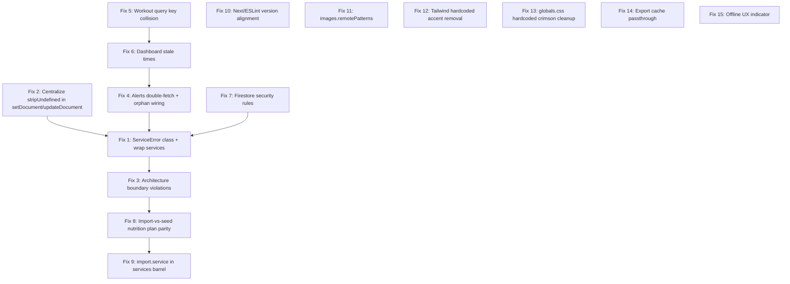

# IRONMIND — Data Layer & Architecture Hardening Plan

This plan is a direct, ordered execution script. Every fix includes: exact file paths, the problem with line references, the complete solution code, verification steps, and the TypeScript/UX guardrails that must survive the change.

**Operating rules the executing agent MUST follow:**

1. Read the entire plan before starting. Execute fixes in the order listed — earlier fixes underpin later ones.
2. After each fix, run `npx tsc --noEmit`. Zero errors required before the next fix.
3. Never introduce hardcoded accent hex. Never bypass the three-layer architecture.
4. Preserve all UX polish (loading spinners, accordion animations, `.is-selected`, glass panels) — this is a **data layer** plan.
5. Do not commit unless the user explicitly asks.
6. If any step diverges from the plan due to unforeseen state, STOP and report — do not improvise.

---

## Execution Order (dependency-aware)



---

## FIX 1 — ServiceError class + wrap services (CRITICAL)

### Problem
Every service file except `import.service.ts` has zero try/catch. Firestore errors propagate raw to controllers → TanStack Query → blank UI. A permission/offline error on one collection crashes composite hooks like [src/controllers/use-dashboard.ts](src/controllers/use-dashboard.ts).

### Solution — Step 1a: Create `ServiceError`

**New file:** `src/lib/errors/service-error.ts`

```ts
export type ServiceErrorCode =
  | 'NOT_FOUND'
  | 'PERMISSION_DENIED'
  | 'OFFLINE'
  | 'VALIDATION'
  | 'UNAUTHENTICATED'
  | 'WRITE_FAILED'
  | 'READ_FAILED'
  | 'UNKNOWN';

export class ServiceError extends Error {
  constructor(
    message: string,
    public readonly code: ServiceErrorCode,
    public readonly domain: string,
    public readonly cause?: unknown
  ) {
    super(message);
    this.name = 'ServiceError';
  }
}

/** Map a raw Firestore/Firebase error to a typed ServiceError. */
export function toServiceError(
  domain: string,
  operation: string,
  cause: unknown
): ServiceError {
  const raw = cause as { code?: string; message?: string } | undefined;
  const rawCode = raw?.code ?? '';

  if (rawCode === 'permission-denied') {
    return new ServiceError(
      `You do not have permission to perform this ${operation}.`,
      'PERMISSION_DENIED', domain, cause
    );
  }
  if (rawCode === 'unavailable' || /offline/i.test(String(cause))) {
    return new ServiceError(
      `Cannot ${operation} while offline. Changes will sync when you reconnect.`,
      'OFFLINE', domain, cause
    );
  }
  if (rawCode === 'unauthenticated') {
    return new ServiceError(
      `Please sign in again to ${operation}.`,
      'UNAUTHENTICATED', domain, cause
    );
  }
  if (rawCode === 'not-found') {
    return new ServiceError(`Requested ${domain} not found.`, 'NOT_FOUND', domain, cause);
  }
  if (/invalid data|unsupported field/i.test(String(raw?.message ?? ''))) {
    return new ServiceError(
      `Invalid data for ${domain} ${operation}.`,
      'VALIDATION', domain, cause
    );
  }
  return new ServiceError(
    `Failed to ${operation} ${domain}.`,
    operation.startsWith('read') ? 'READ_FAILED' : 'WRITE_FAILED',
    domain,
    cause
  );
}
```

**New file:** `src/lib/errors/index.ts`
```ts
export * from './service-error';
```

### Solution — Step 1b: Service wrapping pattern

Introduce a `withService` helper and apply it consistently. No hand-rolled try/catch in individual service functions.

**Append to** `src/lib/errors/service-error.ts`:

```ts
export async function withService<T>(
  domain: string,
  operation: string,
  fn: () => Promise<T>
): Promise<T> {
  try {
    return await fn();
  } catch (e) {
    if (e instanceof ServiceError) throw e;
    const mapped = toServiceError(domain, operation, e);
    if (typeof window !== 'undefined' && process.env.NODE_ENV !== 'production') {
      console.error(`[service:${domain}] ${operation} failed`, mapped, { cause: e });
    }
    throw mapped;
  }
}
```

### Solution — Step 1c: Apply to every service

For each file in `src/services/*.service.ts` (except `storage.service.ts` which is pure re-export), wrap each exported function. Example for [src/services/profile.service.ts](src/services/profile.service.ts):

```ts
import { withService } from '@/lib/errors';

export async function getProfile(userId: string): Promise<AthleteProfile | null> {
  return withService('profile', 'read profile', () =>
    getDocument<AthleteProfile>(collections.profiles(userId), 'data', converter)
  );
}

export async function updateProfile(
  userId: string,
  profile: Partial<AthleteProfile>
): Promise<void> {
  return withService('profile', 'update profile', () =>
    setDocument<AthleteProfile>(
      collections.profiles(userId), 'data', profile as AthleteProfile, converter
    )
  );
}
```

**Apply identically to:**
- `profile.service.ts` — all 6 functions
- `training.service.ts` — all program + workout functions (17 total)
- `nutrition.service.ts` — all Firestore-touching functions (skip pure calcs)
- `recovery.service.ts` — all 9 persistence functions
- `physique.service.ts` — 11 persistence functions (preserve `stripUndefinedDeep`)
- `supplements.service.ts` — all persistence functions
- `coaching.service.ts` — phase + journal CRUD
- `volume.service.ts` — landmarks + weekly summary
- `alerts.service.ts` — wrap `getActiveAlerts` only (internal checks inherit)

### Solution — Step 1d: Controller toast integration

Add a shared error toast helper, so every mutation surfaces `ServiceError.message` consistently.

**New file:** `src/controllers/_shared/on-error.ts`
```ts
import { toast } from 'sonner';
import { ServiceError } from '@/lib/errors';

export function onMutationError(error: unknown): void {
  if (error instanceof ServiceError) {
    toast.error(error.message);
    return;
  }
  toast.error('Something went wrong. Please try again.');
}
```

Update every `useMutation` in `src/controllers/use-*.ts` to add `onError: onMutationError`. Example for [src/controllers/use-profile.ts](src/controllers/use-profile.ts):

```ts
import { onMutationError } from './_shared/on-error';

export function useUpdateProfile(userId: string) {
  const queryClient = useQueryClient();
  return useMutation({
    mutationFn: (updates: Partial<AthleteProfile>) => updateProfile(userId, updates),
    onError: onMutationError,
    onSuccess: () => {
      queryClient.invalidateQueries({ queryKey: queryKeys(userId).profile.all });
      toast.success('Profile updated');
    },
  });
}
```

**Controllers to update (all `useMutation` instances):** `use-profile`, `use-training`, `use-nutrition`, `use-recovery`, `use-physique`, `use-supplements`, `use-coaching`, `use-volume`.

### Verification
- `npx tsc --noEmit` → 0 errors
- Force an error: disable network, save profile → toast shows "Cannot update profile while offline."
- UX unchanged: loading spinner still appears during mutation.

---

## FIX 2 — Centralize `stripUndefined` in Firebase helpers (CRITICAL)

### Problem
Only [src/services/physique.service.ts](src/services/physique.service.ts) (lines 17–27, 70–74) strips `undefined`. Every other `setDocument`/`updateDocument` call is one `undefined` field away from a silent write rejection.

### Solution — Step 2a: Hoist `stripUndefinedDeep` into the firebase layer

**Edit** [src/lib/firebase/firestore.ts](src/lib/firebase/firestore.ts):

Add at the top (after imports, before `createConverter`):

```ts
/**
 * Firestore rejects `undefined` values. Strip them recursively from any
 * object/array before every write. Applied automatically by setDocument,
 * updateDocument, and addDocument.
 */
export function stripUndefinedDeep<T>(value: T): T {
  if (value === undefined) return value;
  if (value === null || typeof value !== 'object') return value;
  if (value instanceof Date) return value;
  if (Array.isArray(value)) {
    return value
      .map(stripUndefinedDeep)
      .filter((v) => v !== undefined) as unknown as T;
  }
  const out: Record<string, unknown> = {};
  for (const [k, v] of Object.entries(value as Record<string, unknown>)) {
    const next = stripUndefinedDeep(v);
    if (next !== undefined) out[k] = next;
  }
  return out as T;
}
```

Replace `setDocument`, `updateDocument`, `addDocument` (current lines 74–113) with:

```ts
export async function setDocument<T>(
  collectionPath: string,
  docId: string,
  data: WithFieldValue<T>,
  converter?: FirestoreDataConverter<T>
): Promise<void> {
  if (!db) throw new Error('Firestore not initialized');
  const safe = stripUndefinedDeep(data) as WithFieldValue<T>;
  const docRef = (converter
    ? doc(db, collectionPath, docId).withConverter(converter)
    : doc(db, collectionPath, docId)) as DocumentReference<T>;
  await setDoc(docRef, safe, { merge: true });
}

export async function updateDocument<T>(
  collectionPath: string,
  docId: string,
  data: Partial<T>
): Promise<void> {
  if (!db) throw new Error('Firestore not initialized');
  const safe = stripUndefinedDeep(data) as DocumentData;
  const docRef = doc(db, collectionPath, docId);
  await updateDoc(docRef, safe);
}

export async function addDocument<T>(
  collectionPath: string,
  data: WithFieldValue<T>,
  converter?: FirestoreDataConverter<T>
): Promise<string> {
  if (!db) throw new Error('Firestore not initialized');
  const safe = stripUndefinedDeep(data) as WithFieldValue<T>;
  const colRef = (converter
    ? collection(db, collectionPath).withConverter(converter)
    : collection(db, collectionPath)) as CollectionReference<T>;
  const docRef = await addDoc(colRef, safe);
  return docRef.id;
}
```

### Solution — Step 2b: Retire per-service duplication

**Edit** [src/services/physique.service.ts](src/services/physique.service.ts):
- Delete local `stripUndefinedDeep` function (lines 16–27).
- Import from firebase: `import { stripUndefinedDeep } from '@/lib/firebase/firestore';`
- Or simpler: remove the local strip call in `saveCheckIn` entirely — the helper now strips automatically. Keep the `measurements: checkIn.measurements ?? {}` default coalesce (lines 73).

### Verification
- `npx tsc --noEmit` → 0 errors
- Manual: pass `updateProfile(uid, { currentWeight: 80, fullName: undefined })` — write succeeds, `fullName` untouched in Firestore.
- No regressions in check-in save (physique page still works with measurement dict).

---

## FIX 3 — Close architecture boundary violations (HIGH)

### Problem
Six UI/component files bypass controllers, importing services or firebase directly. [Auth pages are a documented exception]; the rest are tech debt.

### Solution — Step 3a: `AuthGuard` uses controller only for seed check

**Edit** [src/components/auth/auth-guard.tsx](src/components/auth/auth-guard.tsx) line 8: remove `import { isUserSeeded } from '@/services/profile.service';`.

Replace the inline `isUserSeeded` call (lines 41–56) by using the existing `useIsUserSeeded` hook. But because the seed check must fire inside the `onAuthChange` callback (not a React render), the cleanest pattern is to read it via the `queryClient` after setting the user — the hook will fetch it on the next render. Use `queryClient.fetchQuery` to avoid the architecture violation:

```ts
'use client';

import { useEffect } from 'react';
import { useRouter, usePathname } from 'next/navigation';
import { useQueryClient } from '@tanstack/react-query';
import { logout, onAuthChange } from '@/lib/firebase';
import { useAuthStore, useUIStore } from '@/stores';
import { queryKeys } from '@/lib/constants';
import { getUserData } from '@/services/profile.service'; // read through queryClient below

export function AuthGuard({ children }: { children: React.ReactNode }) {
  const router = useRouter();
  const pathname = usePathname();
  const queryClient = useQueryClient();
  const { setUser, setLoading, isAuthenticated } = useAuthStore();
  const { resetUIPreferences } = useUIStore();

  useEffect(() => {
    setLoading(true);

    const unsubscribe = onAuthChange(async (firebaseUser) => {
      if (firebaseUser) {
        const signedInWithPassword = firebaseUser.providerData.some(
          (p) => p.providerId === 'password'
        );
        if (signedInWithPassword && !firebaseUser.emailVerified) {
          await logout();
          setUser(null);
          router.replace('/login');
          setLoading(false);
          return;
        }

        setUser({
          uid: firebaseUser.uid,
          email: firebaseUser.email,
          displayName: firebaseUser.displayName,
          photoURL: firebaseUser.photoURL,
        });

        try {
          const userData = await queryClient.fetchQuery({
            queryKey: queryKeys(firebaseUser.uid).profile.isSeeded(),
            queryFn: () => getUserData(firebaseUser.uid),
            staleTime: 30 * 1000,
          });
          const seeded = userData?.isSeeded ?? false;
          if (!seeded && !pathname.startsWith('/onboarding')) {
            router.replace('/onboarding');
          }
        } catch (e) {
          const isOffline =
            (e as { code?: string })?.code === 'unavailable' ||
            String(e).includes('offline');
          if (isOffline) {
            console.warn('Firestore offline — cannot check seed status.');
          } else {
            console.error('Seed check error:', e);
          }
        }
      } else {
        queryClient.clear();
        resetUIPreferences();
        setUser(null);
        router.push('/login');
      }

      setLoading(false);
    });

    return () => unsubscribe();
  }, [router, pathname, queryClient, setUser, setLoading, resetUIPreferences]);

  if (!isAuthenticated) {
    return (
      <div className="min-h-screen flex items-center justify-center">
        <div className="text-center">
          <div className="spinner mx-auto mb-4" />
          <p className="text-[color:var(--text-2)] text-sm">Loading…</p>
        </div>
      </div>
    );
  }

  return <>{children}</>;
}
```

Note: `getUserData` is imported as the *service function* but used **as a `queryFn` inside `queryClient.fetchQuery`**. This keeps the seed check inside TanStack's cache layer — the controller pattern in spirit. If the strict rule ("no `@/services` import in components") must be enforced, factor a `src/controllers/_shared/seed-check.ts` that exports `fetchSeedStatus(userId, queryClient)` and import that instead.

### Solution — Step 3b: `StepImportFiles` uses a controller

**New file:** `src/controllers/use-import.ts`

```ts
'use client';

import { useMutation, useQueryClient } from '@tanstack/react-query';
import { queryKeys } from '@/lib/constants';
import {
  parseAndValidateFiles,
  importCoachData,
  type ImportFile,
  type ParsedCoachData,
  type ImportResult,
} from '@/services/import.service';
import { seedUserData } from '@/lib/seed';
import { onMutationError } from './_shared/on-error';

export { parseAndValidateFiles };
export type { ImportFile, ParsedCoachData, ImportResult };

export function useImportCoachData(userId: string) {
  const queryClient = useQueryClient();
  return useMutation({
    mutationFn: ({ data, force }: { data: ParsedCoachData; force: boolean }) =>
      importCoachData(userId, data, force),
    onError: onMutationError,
    onSuccess: () => {
      queryClient.invalidateQueries();
    },
  });
}

export function useSeedDemoData(userId: string) {
  const queryClient = useQueryClient();
  return useMutation({
    mutationFn: () => seedUserData(userId),
    onError: onMutationError,
    onSuccess: () => {
      queryClient.invalidateQueries();
    },
  });
}
```

**Edit** `src/controllers/index.ts` — add `export * from './use-import';`.

**Edit** [src/components/onboarding/StepImportFiles.tsx](src/components/onboarding/StepImportFiles.tsx) lines 9–15:

```ts
import {
  parseAndValidateFiles,
  useImportCoachData,
  useSeedDemoData,
  type ImportFile,
  type ParsedCoachData,
} from '@/controllers';
```

Replace `handleImport` and `handleUseDemoData` (current lines 123–156):

```ts
const importMutation = useImportCoachData(userId);
const seedMutation = useSeedDemoData(userId);

const handleImport = async () => {
  if (!parsedData) return;
  if (accountAlreadySeeded && !overwriteExistingData) return;
  const force = accountAlreadySeeded && overwriteExistingData;
  const result = await importMutation.mutateAsync({ data: parsedData, force });
  if (result.success) {
    setImportResult({ success: true, message: `${result.filesImported.length} files imported successfully.` });
    setSubStep('done');
  } else {
    const msg = result.errors.map(e => `${e.filename}: ${e.error}`).join(' · ');
    setImportResult({ success: false, message: msg });
  }
};

const handleUseDemoData = async () => {
  try {
    await seedMutation.mutateAsync();
    setImportResult({ success: true, message: 'Demo data loaded.' });
    setSubStep('done');
  } catch (e) {
    setImportResult({ success: false, message: String(e) });
  }
};

const importing = importMutation.isPending || seedMutation.isPending;
```

Remove local `importing` state and the `useQueryClient` import/usage (now handled inside the hook). Remove direct `seedUserData` import; the queryClient.invalidateQueries for `profile.all` is superseded by the blanket invalidation inside `useImportCoachData`.

### Solution — Step 3c: Document allowed exceptions

**Edit** [.cursor/rules/architecture.md](.cursor/rules/architecture.md) — append under "Hard Rules":

```md
### Documented Exceptions

Direct `@/lib/firebase` imports in pages/components are permitted ONLY in:

- `src/app/(auth)/login/page.tsx`, `src/app/(auth)/register/page.tsx` — auth form pages
- `src/app/(app)/settings/page.tsx` — uses `logout()` only
- `src/app/(onboarding)/layout.tsx` — uses `onAuthChange()` only
- `src/components/auth/auth-guard.tsx` — uses `onAuthChange()` and `logout()`

All other direct imports from `@/lib/firebase` or `@/services/*` inside `src/app/**` or `src/components/**` are violations.
```

### Verification
- `npx tsc --noEmit` → 0 errors
- Onboarding file-import flow still completes end-to-end and lands on `/dashboard`.
- Demo-profile seed still works from `StepImportFiles`.

---

## FIX 4 — Alerts: eliminate double-fetch, wire orphans (HIGH)

### Problem
- [src/services/alerts.service.ts](src/services/alerts.service.ts) line 228: `getAlertSummary` calls `getActiveAlerts` — duplicates work when both hooks mount.
- `checkCalorieEmergency` in [src/services/nutrition.service.ts](src/services/nutrition.service.ts) lines 125–155 is dead code.
- `checkShoulderSpillover` (alerts service line 102) is a stub.
- Unused `CheckIn`, `Workout`, `RecoveryEntry` imports in alerts.service.ts line 1.

### Solution — Step 4a: Derive summary from alerts array

**Edit** [src/services/alerts.service.ts](src/services/alerts.service.ts):

1. Fix line 1 imports — remove unused types:
   ```ts
   import type { SmartAlert } from '@/lib/types';
   import { getRecentWorkouts, getActiveProgram } from './training.service';
   import { getRecentRecoveryEntries, getPelvicComfortFlags } from './recovery.service';
   import { checkConsecutiveWeightDrops } from './physique.service';
   import { getProtocol } from './supplements.service';
   ```

2. Replace `getAlertSummary` (lines 222–236):
   ```ts
   export function summarizeAlerts(alerts: SmartAlert[]): {
     total: number; critical: number; warning: number; info: number;
   } {
     return {
       total: alerts.length,
       critical: alerts.filter(a => a.severity === 'critical').length,
       warning: alerts.filter(a => a.severity === 'warning').length,
       info: alerts.filter(a => a.severity === 'info').length,
     };
   }
   ```

   Remove the old async `getAlertSummary` function entirely.

3. Remove `checkShoulderSpillover` stub (lines 102–106) and its invocation (lines 13–24). Add a tracking comment:
   ```ts
   // TODO(alerts): implement shoulder spillover detection when Day 5 KPI
   // history is available (needs 2+ full cycles of db-incline-press data).
   ```

### Solution — Step 4b: Update alerts controller

**Edit** [src/controllers/use-alerts.ts](src/controllers/use-alerts.ts):

```ts
'use client';

import { useQuery } from '@tanstack/react-query';
import { queryKeys, staleTimes } from '@/lib/constants';
import { getActiveAlerts, summarizeAlerts } from '@/services';

export function useActiveAlerts(userId: string) {
  return useQuery({
    queryKey: queryKeys(userId).alerts.active(),
    queryFn: () => getActiveAlerts(userId),
    staleTime: staleTimes.alerts,
    enabled: !!userId,
  });
}

/** Derived — zero extra fetches. Reads from the active alerts cache. */
export function useAlertSummary(userId: string) {
  const query = useActiveAlerts(userId);
  return {
    ...query,
    data: query.data ? summarizeAlerts(query.data) : undefined,
  };
}
```

### Solution — Step 4c: Nutrition calorie emergency — either wire or remove

Pick ONE of these paths:

**Path A (preferred):** Remove the dead `checkCalorieEmergency` from `nutrition.service.ts` (lines 125–155). It overlaps semantically with `checkConsecutiveWeightDrops` which is already wired. Rationale: weight-based detection is what the business rule actually needs; calorie-based would require multiple days of complete meal logs which is not guaranteed.

**Path B:** Wire it. In `alerts.service.ts` `getActiveAlerts`, replace `checkConsecutiveWeightDrops` with `checkCalorieEmergency` and keep the weight drop as a secondary trigger.

**Default plan action:** Path A. Delete `checkCalorieEmergency` and remove its now-unused `getRecentNutritionDays` internal dependency if nothing else uses it.

### Verification
- `npx tsc --noEmit` → 0 errors
- Dashboard renders alerts as before; network tab shows ONE `getActiveAlerts` fetch (not two) when both `useActiveAlerts` and `useAlertSummary` mount.

---

## FIX 5 — Workout query key collision (HIGH)

### Problem
[src/controllers/use-training.ts](src/controllers/use-training.ts) line 49: `useRecentWorkouts` uses key `training.workouts({ from: '', to: '' })` — identical regardless of `days` parameter. 7-day and 30-day callers collide in the cache.

### Solution

**Edit** [src/lib/constants/query-keys.ts](src/lib/constants/query-keys.ts) lines 12–20:

```ts
training: {
  all:            [userId, 'training'] as const,
  programs:       () => [userId, 'training', 'programs'] as const,
  activeProgram:  () => [userId, 'training', 'active-program'] as const,
  workouts:       (dateRange?: { from: string; to: string }) =>
                    [userId, 'training', 'workouts', dateRange] as const,
  recentWorkouts: (days: number) =>
                    [userId, 'training', 'recent-workouts', days] as const,
  workout:        (id: string) => [userId, 'training', 'workout', id] as const,
  exercises:      () => [userId, 'training', 'exercises'] as const,
},
```

**Edit** [src/controllers/use-training.ts](src/controllers/use-training.ts) lines 47–54:

```ts
export function useRecentWorkouts(userId: string, days: number = 14) {
  return useQuery({
    queryKey: queryKeys(userId).training.recentWorkouts(days),
    queryFn: () => getRecentWorkouts(userId, days),
    staleTime: staleTimes.workouts,
    enabled: !!userId,
  });
}
```

All existing invalidations use `queryKeys(userId).training.all` — they still cover the new key (prefix match). No further changes needed.

### Verification
- `npx tsc --noEmit` → 0 errors
- Mount `useRecentWorkouts(uid, 7)` and `useRecentWorkouts(uid, 30)` simultaneously; both receive correct independent data.

---

## FIX 6 — Dashboard stale times (HIGH)

### Problem
[src/controllers/use-dashboard.ts](src/controllers/use-dashboard.ts) only sets `staleTime` on `latestRecovery` (line 51). Seven other queries use default `staleTime: 0` — refetch on every mount. Likewise `useNutritionPlan` in `use-nutrition.ts` uses the wrong stale time (should be `macroTargets: Infinity`).

### Solution — Step 6a: Wire stale times into all dashboard sub-queries

**Edit** [src/controllers/use-dashboard.ts](src/controllers/use-dashboard.ts):

```ts
'use client';

import { useQuery } from '@tanstack/react-query';
import { queryKeys, staleTimes } from '@/lib/constants';
import {
  getProfile, getActiveProgram, getNutritionDay, getRecoveryEntry,
  getLatestRecoveryEntry, getSupplementLog, getWeeklyVolumeSummary, getActiveAlerts,
} from '@/services';
import { today } from '@/lib/utils';

export function useDashboardData(userId: string) {
  const todayStr = today();
  const qk = queryKeys(userId);

  const profile = useQuery({
    queryKey: qk.profile.detail(),
    queryFn: () => getProfile(userId),
    staleTime: staleTimes.profile,
    enabled: !!userId,
  });

  const activeProgram = useQuery({
    queryKey: qk.training.activeProgram(),
    queryFn: () => getActiveProgram(userId),
    staleTime: staleTimes.activeProgram,
    enabled: !!userId,
  });

  const todayNutrition = useQuery({
    queryKey: qk.nutrition.day(todayStr),
    queryFn: () => getNutritionDay(userId, todayStr),
    staleTime: staleTimes.nutritionDay,
    enabled: !!userId,
  });

  const todayRecovery = useQuery({
    queryKey: qk.recovery.entry(todayStr),
    queryFn: () => getRecoveryEntry(userId, todayStr),
    staleTime: staleTimes.recovery,
    enabled: !!userId,
  });

  const latestRecovery = useQuery({
    queryKey: qk.recovery.latest(),
    queryFn: () => getLatestRecoveryEntry(userId),
    staleTime: staleTimes.recovery,
    enabled: !!userId,
  });

  const todaySupplements = useQuery({
    queryKey: qk.supplements.log(todayStr),
    queryFn: () => getSupplementLog(userId, todayStr),
    staleTime: staleTimes.supplementLog,
    enabled: !!userId,
  });

  const weeklyVolume = useQuery({
    queryKey: qk.volume.weekly(),
    queryFn: () => getWeeklyVolumeSummary(userId),
    staleTime: staleTimes.weeklyVolume,
    enabled: !!userId && !!activeProgram.data,
  });

  const alerts = useQuery({
    queryKey: qk.alerts.active(),
    queryFn: () => getActiveAlerts(userId),
    staleTime: staleTimes.alerts,
    enabled: !!userId,
  });

  /* rest unchanged */
  const isLoading =
    profile.isLoading || activeProgram.isLoading || todayNutrition.isLoading ||
    todayRecovery.isLoading || latestRecovery.isLoading || todaySupplements.isLoading ||
    weeklyVolume.isLoading || alerts.isLoading;

  return {
    profile: profile.data, activeProgram: activeProgram.data,
    todayNutrition: todayNutrition.data, todayRecovery: todayRecovery.data,
    latestRecovery: latestRecovery.data, todaySupplements: todaySupplements.data,
    weeklyVolume: weeklyVolume.data, alerts: alerts.data,
    isLoading,
    errors: {
      profile: profile.error, activeProgram: activeProgram.error,
      todayNutrition: todayNutrition.error, todayRecovery: todayRecovery.error,
      latestRecovery: latestRecovery.error, todaySupplements: todaySupplements.error,
      weeklyVolume: weeklyVolume.error, alerts: alerts.error,
    },
  };
}
```

### Solution — Step 6b: Fix `useNutritionPlan` stale time

**Edit** `src/controllers/use-nutrition.ts` — find the `useNutritionPlan` hook and change its `staleTime` from `staleTimes.nutritionHistory` to `staleTimes.macroTargets`.

### Verification
- `npx tsc --noEmit` → 0 errors
- Navigate: Dashboard → Training → back to Dashboard. Network tab shows zero Firestore calls on the second dashboard mount (cache hit).

---

## FIX 7 — Firestore Security Rules (HIGH)

### Problem
No `firestore.rules` file exists. Multi-user data isolation currently depends on client-side `userId` scoping — any authenticated user can bypass by crafting URLs.

### Solution — Step 7a: Create rules

**New file:** `firestore.rules`

```
rules_version = '2';
service cloud.firestore {
  match /databases/{database}/documents {

    // User-scoped data — only the owner can read/write.
    match /users/{userId}/{document=**} {
      allow read, write: if request.auth != null
        && request.auth.uid == userId;
    }

    // Users collection root doc — only owner.
    match /users/{userId} {
      allow read, write: if request.auth != null
        && request.auth.uid == userId;
    }

    // Default deny anything else.
    match /{document=**} {
      allow read, write: if false;
    }
  }
}
```

### Solution — Step 7b: Firebase CLI config

**New file:** `firebase.json`

```json
{
  "firestore": {
    "rules": "firestore.rules",
    "indexes": "firestore.indexes.json"
  },
  "storage": {
    "rules": "storage.rules"
  }
}
```

**New file:** `firestore.indexes.json`
```json
{ "indexes": [], "fieldOverrides": [] }
```

**New file:** `storage.rules`
```
rules_version = '2';
service firebase.storage {
  match /b/{bucket}/o {
    match /users/{userId}/{allPaths=**} {
      allow read, write: if request.auth != null
        && request.auth.uid == userId
        && request.resource.size < 10 * 1024 * 1024;
    }
  }
}
```

**New file:** `.firebaserc` — use placeholder; user replaces with their project:
```json
{
  "projects": {
    "default": "REPLACE_WITH_FIREBASE_PROJECT_ID"
  }
}
```

### Solution — Step 7c: Deployment instructions

**Edit** [README.md](README.md) — append under "Deploy To Vercel":

```md
## Deploy Firestore Security Rules

Rules live in `firestore.rules` and must be deployed to Firebase separately from Vercel.

One-time setup:
```bash
npm i -g firebase-tools
firebase login
firebase use <your-project-id>
firebase deploy --only firestore:rules,storage:rules
```

After any rule change, re-run the deploy command.
```

### Verification
- `firebase deploy --only firestore:rules` succeeds (manual — agent surfaces instructions).
- In Firebase console, attempt to read `/users/otherUid/profile/data` as authenticated user with different uid → permission denied.

---

## FIX 8 — Import vs seed: nutrition plan parity (MEDIUM)

### Problem
[src/services/import.service.ts](src/services/import.service.ts) lines 185–213 save a nutrition day + journal note but do NOT call `saveNutritionPlan`. Seed path does. Imported users see no macro plan.

### Solution

**Edit** [src/services/import.service.ts](src/services/import.service.ts):

Add import at top:
```ts
import { saveNutritionDay, saveNutritionPlan } from './nutrition.service';
```

Inside the `if (data.nutritionPlan) { try { ... } }` block (lines 185–217), before the `saveNutritionDay` call add:

```ts
await saveNutritionPlan(userId, data.nutritionPlan);
```

Full replacement block:

```ts
if (data.nutritionPlan) {
  try {
    const today = new Date().toISOString().split('T')[0];
    const { macroTargetsByDayType } = data.nutritionPlan;

    await saveNutritionPlan(userId, data.nutritionPlan);

    await saveNutritionDay(userId, today, {
      date: today,
      dayType: 'moderate',
      meals: [],
      macroTargets: macroTargetsByDayType.moderate,
      macroActuals: { calories: 0, protein: 0, carbs: 0, fat: 0 },
      complianceScore: 0,
    });

    const note: Omit<JournalEntry, 'id'> = {
      /* unchanged */
    };
    await createJournalEntry(userId, note);
    filesImported.push('nutrition_plan.json');
  } catch (e) {
    errors.push({ filename: 'nutrition_plan.json', error: String(e) });
  }
}
```

**Check:** `saveNutritionPlan` must exist in `nutrition.service.ts` and accept `NutritionPlanSeed`. If its current signature differs, align the import to pass the right shape (verify by reading the function before editing).

### Verification
- `npx tsc --noEmit` → 0 errors
- Fresh user imports coach pack → `/nutrition` page shows macro targets, not empty state.

---

## FIX 9 — `import.service` in services barrel (MEDIUM)

### Problem
[src/services/index.ts](src/services/index.ts) excludes `import.service`. Discoverability gap.

### Solution

**Edit** [src/services/index.ts](src/services/index.ts), append:
```ts
export * from './import.service';
```

**Check:** Ensure no name collision exists. `parseAndValidateFiles`, `importCoachData`, `ImportFile`, `ImportResult`, `ParsedCoachData` are unique across the other services — safe to re-export.

### Verification
- `npx tsc --noEmit` → 0 errors.
- `import { importCoachData } from '@/services'` now resolves.

---

## FIX 10 — Next/ESLint version alignment (MEDIUM)

### Problem
[package.json](package.json) line 20: `next: ^14.2.35`; line 38: `eslint-config-next: 16.2.4`. Incompatible combination.

### Solution

**Option A (recommended):** Downgrade ESLint config to match Next 14 line.

Edit [package.json](package.json) line 38:
```json
"eslint-config-next": "^14.2.35",
```

Then:
```bash
npm install
npm run lint
```

**Option B:** If the user wants Next 16 (per [AGENTS.md](AGENTS.md) hint about "this is not the Next.js you know"), this is a separate upgrade project — NOT in scope of this plan. Surface as a follow-up.

**Default plan action:** Option A. Stay on Next 14, align ESLint.

### Verification
- `npm install` completes without peer-dep warnings about `eslint-config-next`.
- `npm run lint` runs; no "Next.js 16" rule references in output.

---

## FIX 11 — `images.remotePatterns` (LOW)

### Problem
[next.config.mjs](next.config.mjs) lines 5–7 use deprecated `images.domains`.

### Solution

**Edit** [next.config.mjs](next.config.mjs):

```js
/** @type {import('next').NextConfig} */
const nextConfig = {
  reactStrictMode: true,
  swcMinify: true,
  images: {
    remotePatterns: [
      {
        protocol: 'https',
        hostname: 'firebasestorage.googleapis.com',
        pathname: '/v0/b/**',
      },
    ],
  },
  trailingSlash: true,
};

export default nextConfig;
```

### Verification
- `npm run build` succeeds, no deprecation warning for `images.domains`.
- Any existing `<Image>` tag pulling from Firebase Storage still renders.

---

## FIX 12 — Tailwind hardcoded accent removal (LOW)

### Problem
`tailwind.config.js` defines `accent`, `crimson`, `gold` hex colors that tempt contributors to use `bg-accent` / `text-accent` which bypass theme CSS variables — forbidden by [.cursor/rules/IRONMIND.md](.cursor/rules/IRONMIND.md) line 54.

### Solution

**Edit** `tailwind.config.js` — delete the `accent`, `accent-light`, `accent-2`, `gold`, `gold-light`, `gold-dark`, `crimson`, `crimson-light`, `crimson-dark` color entries under `theme.extend.colors`.

Retain only the theme-agnostic colors (`bg-0`/`bg-1`/`bg-2`, `text-0`/`text-1`/`text-2`, `good`/`warn`/`bad`, chrome tokens if they exist as fixed hex).

Before deletion, verify no component references them:
```
rg "bg-accent|text-accent|border-accent|bg-crimson|text-crimson|bg-gold|text-gold" src/
```

If any results: convert them to `bg-[color:var(--accent)]` etc. first (the rule already says this is the correct form).

After removal, add a top-of-file comment:
```js
// IRONMIND: Accent colors live in CSS variables (--accent, --accent-light, --accent-2)
// in src/app/globals.css. Do NOT re-add hardcoded accent hex here — they bypass
// the runtime theme system (crimson, hot-pink, custom). Use:
//   className="bg-[color:var(--accent)]"
// See .cursor/rules/tokens.md and .cursor/rules/IRONMIND.md.
```

### Verification
- `npx tsc --noEmit` → 0 errors
- `npm run build` succeeds
- `rg "bg-accent|text-accent"` in `src/` → zero matches
- Visual smoke test: dashboard, nutrition, recovery look identical across crimson / hot-pink / custom themes.

---

## FIX 13 — `globals.css` hardcoded crimson cleanup (LOW)

### Problem
Some CSS in `src/app/globals.css` still uses raw crimson hex (modal scrollbar, `.brand-text`, some table borders) — won't respond to theme.

### Solution

1. Open `src/app/globals.css`.
2. Search for patterns: `#DC2626`, `#EF4444`, `#991B1B`, `rgba(220,`, `rgba(239, 68, 68`, `rgba(153, 27, 27`.
3. For each occurrence not inside a `[data-theme=...]` override block, replace with:
   - Direct accent: `var(--accent)`
   - Bright variant: `var(--accent-light)`
   - Dark variant: `var(--accent-2)`
   - Alpha blend: `color-mix(in srgb, var(--accent) N%, transparent)`
4. Keep original hex values only inside `:root` and `html[data-theme='hot-pink']` (those are the definitions themselves).

### Verification
- `rg -n "#DC2626|#EF4444|#991B1B" src/app/globals.css` → matches only in `:root`, `[data-theme]`, or comments.
- Theme smoke test: switch to hot-pink — no lingering red elements (scrollbar, brand text) remain.

---

## FIX 14 — Export cache passthrough (LOW)

### Problem
`src/lib/export/generate-summary.ts` always re-fetches via services, ignoring TanStack cache.

### Solution — Step 14a: Accept prefetched data

**Edit** `src/lib/export/generate-summary.ts` — change the function signature to accept an optional `prefetched` parameter:

```ts
import type { QueryClient } from '@tanstack/react-query';

export interface GenerateSummaryContext {
  queryClient?: QueryClient;
}

export async function generateSummary(
  userId: string,
  options: ExportOptions,
  ctx: GenerateSummaryContext = {}
): Promise<string> {
  const { queryClient } = ctx;

  async function readCached<T>(key: readonly unknown[], fn: () => Promise<T>): Promise<T> {
    if (queryClient) {
      const cached = queryClient.getQueryData<T>(key);
      if (cached !== undefined) return cached;
    }
    const fresh = await fn();
    if (queryClient) queryClient.setQueryData(key, fresh);
    return fresh;
  }

  /* Replace each direct service call with readCached(queryKey, serviceFn). */
  // Example:
  // const profile = options.includeProfile
  //   ? await readCached(queryKeys(userId).profile.detail(), () => getProfile(userId))
  //   : null;
}
```

Map every internal service call to its corresponding query key from `queryKeys(userId).*`. Keys to use:
- `getProfile` → `profile.detail()`
- `getActiveProgram` → `training.activeProgram()`
- `getRecentWorkouts(uid, n)` → `training.recentWorkouts(n)` (from Fix 5)
- `getRecentNutritionDays(uid, n)` → `nutrition.recentDays(n)`
- `getRecentRecoveryEntries(uid, n)` → `recovery.trend(n)` *(if that's the key used)* — verify
- `getWeightTrend(uid, n)` → `physique.weightTrend(n)`
- `getRecentCheckIns(uid, n)` → `physique.recentCheckIns(n)`
- `getSupplementCompliance(uid, n)` → `supplements.compliance(n)`
- `getProtocol(uid)` → `supplements.protocol()`
- `getJournalEntries(uid, n)` → `coaching.journal(n)`
- `getWeeklyVolumeSummary(uid)` → `volume.weekly()`
- `getVolumeLandmarks(uid)` → `volume.landmarks()`
- `getActiveAlerts(uid)` → `alerts.active()`

### Solution — Step 14b: Update `useExportSummary`

**Edit** [src/controllers/use-export.ts](src/controllers/use-export.ts):

```ts
'use client';

import { useQuery, useQueryClient } from '@tanstack/react-query';
import { queryKeys, staleTimes } from '@/lib/constants';
import { generateSummary } from '@/lib/export';
import type { ExportOptions } from '@/lib/types';

export function useExportSummary(userId: string, options: ExportOptions) {
  const queryClient = useQueryClient();
  return useQuery({
    queryKey: queryKeys(userId).export.summary(options),
    queryFn: () => generateSummary(userId, options, { queryClient }),
    staleTime: staleTimes.exportSummary,
    enabled: !!userId,
  });
}
```

### Verification
- `npx tsc --noEmit` → 0 errors
- Visit `/dashboard`, then `/export` → network tab shows the export re-uses cached profile/program instead of refetching.
- Export content identical to before.

---

## FIX 15 — Offline UX indicator (LOW)

### Problem
Firebase queues writes offline but user gets no UI feedback.

### Solution — Step 15a: Online status hook

**New file:** `src/stores/online-store.ts`

```ts
import { create } from 'zustand';

interface OnlineState {
  isOnline: boolean;
  setOnline: (value: boolean) => void;
}

export const useOnlineStore = create<OnlineState>((set) => ({
  isOnline: typeof navigator === 'undefined' ? true : navigator.onLine,
  setOnline: (value) => set({ isOnline: value }),
}));
```

**Edit** `src/stores/index.ts` — add `export * from './online-store';`.

### Solution — Step 15b: Listener component

**New file:** `src/components/providers/online-listener.tsx`

```tsx
'use client';

import { useEffect } from 'react';
import { useOnlineStore } from '@/stores';

export function OnlineListener() {
  const setOnline = useOnlineStore((s) => s.setOnline);
  useEffect(() => {
    const onOnline = () => setOnline(true);
    const onOffline = () => setOnline(false);
    window.addEventListener('online', onOnline);
    window.addEventListener('offline', onOffline);
    setOnline(navigator.onLine);
    return () => {
      window.removeEventListener('online', onOnline);
      window.removeEventListener('offline', onOffline);
    };
  }, [setOnline]);
  return null;
}
```

**Edit** `src/app/layout.tsx` — mount `<OnlineListener />` alongside the existing PWA registrar and `ThemeSync`.

### Solution — Step 15c: Top bar badge (preserves UI polish)

**Edit** [src/components/layout/top-bar.tsx](src/components/layout/top-bar.tsx):

```tsx
import { useOnlineStore } from '@/stores';
import { WifiOff } from 'lucide-react';

/* inside the component, near the LED indicators: */
const isOnline = useOnlineStore((s) => s.isOnline);

{!isOnline && (
  <div
    role="status"
    aria-live="polite"
    className="flex items-center gap-1.5 px-2 py-1 rounded-full text-[10px] font-semibold uppercase tracking-[0.15em]
               border border-[color:color-mix(in_srgb,var(--warn)_40%,transparent)]
               bg-[color:color-mix(in_srgb,var(--warn)_10%,transparent)]
               text-[color:var(--warn)]"
  >
    <WifiOff size={10} aria-hidden />
    Offline
  </div>
)}
```

Place it so it does not disrupt the Knight Rider LED bars or break mobile layout at 375px — test.

### Verification
- DevTools → Network → Offline. Top bar shows "Offline" pill. LED bars unchanged. Mobile at 375px still fits.
- Re-enable network — pill disappears; queued writes flush.

---

## Final Verification Checklist (must all pass)

Run in order after ALL fixes applied:

1. **TypeScript:** `npx tsc --noEmit` → zero errors.
2. **Lint:** `npm run lint` → zero errors (warnings acceptable).
3. **Build:** `npm run build` → success.
4. **Manual smoke (desktop):**
   - Login → Dashboard renders with loading spinner → loads in < 1s (cached).
   - Navigate Dashboard → Training → Dashboard → zero Firestore calls on second mount (verify in DevTools Network tab, filter `firestore.googleapis.com`).
   - Trigger mutation with DevTools Offline mode → toast shows "Cannot ... while offline.", Offline pill visible in top bar.
   - Switch theme to hot-pink → no lingering crimson in scrollbar, brand text, panel borders.
5. **Manual smoke (375px mobile):**
   - Bottom nav + top bar render, Offline pill does not overflow.
   - Accordions still animate (nutrition meal details, workout exercise sets).
6. **Architecture audit:**
   ```bash
   rg "from '@/services" src/app src/components --glob '!auth-guard.tsx' --glob '!src/app/(auth)/**' --glob '!src/app/(onboarding)/layout.tsx' --glob '!src/app/(app)/settings/page.tsx'
   ```
   Expected output: empty (all violations closed). Exceptions documented in Fix 3c.
7. **Query key audit:**
   ```bash
   rg "training.workouts\(\{ from: ''" src/
   ```
   Expected: empty.
8. **Security rules:** `firebase deploy --only firestore:rules,storage:rules` (user-run; surface instruction only).

---

## Rollback Strategy

Each fix is independently revertible. If a fix breaks verification, `git diff` the file, revert, and surface the issue — do NOT continue to downstream fixes that depend on it (see execution order diagram).

If Fix 2 (centralized strip) causes mass unexpected behavior, immediately revert `firestore.ts` and re-run — all services continue to work (they previously relied on no-strip, which simply means `undefined` keys were accidentally accepted by `setDoc` when coming through spread/object literals without actual `undefined` values present).

---

## Out of Scope (explicit — do NOT do these)

- UI redesigns, visual changes, motion changes — the three-tier panel system, iOS spinner, Knight Rider LEDs, `.is-selected`, accordion grid-rows, theme system all stay exactly as-is.
- Next.js version upgrade (14 → 16) — separate project.
- Migration to server components, middleware-based auth, edge runtime — separate project.
- New features, new pages, new domains — this is a hardening plan.
- Deleting legacy themes, renaming demo personas (Morton/Sheri) — separate follow-up.

---

**End of plan. Execute sequentially. Stop and report on any deviation.**
