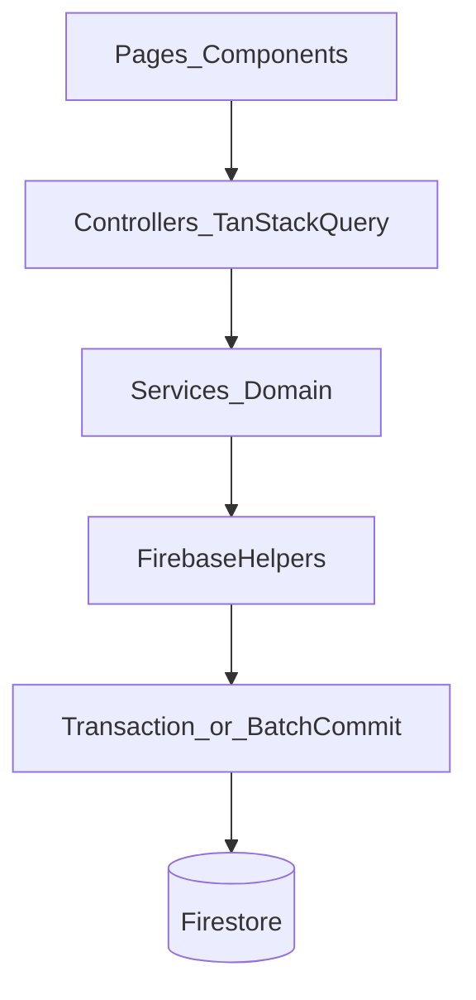

# Principal-level data review and remediation program

## Deliverable (what “done” means)

- Author **one canonical markdown document** at [`Documentation/PRINCIPAL-REVIEW-DATA-2026-04-23.md`](Documentation/PRINCIPAL-REVIEW-DATA-2026-04-23.md) (date adjust to ship day if needed).
- The document **must** contain six top-level sections, **in this exact order**, each using **this exact subsection heading set** (no substitutions):
  1. `## Data Modeling`
  2. `## Query & Performance`
  3. `## Business Logic`
  4. `## API`
  5. `## Storage`
  6. `## Reliability`

- Inside **each** section, include **all** of the following subsections **in this order** (verbatim labels):
  - `### Executive Verdict`
  - `### Risks Found` (numbered list, severity-ranked: Critical first)
  - `### User Impact`
  - `### Technical Cause` (tie each risk to concrete code paths)
  - `### Recommended Fix` (must be implementable; no hand-wavy “consider”)
  - `### UX/UI Impact` (explicit: latency, trust, offline, mobile, cache churn)
  - `### Priority` (one of: Critical / High / Medium / Low per risk)
  - `### Implementation Notes` (files to touch, sequencing constraints, rollback)

- Add a final appendix: `## Remediation timeline` with **2-week** and **6-week** plans (below supplies the required content to paste/expand).

---

## Documentation gate (mandatory on completion of each phase)

**Rule:** No remediation phase is “complete” until **all** documentation items below are updated in the **same PR** as the code change, or in a **follow-up PR merged immediately after** (same day) with an explicit link from the code PR description. “Complete” means: no stale claims, no orphaned index entries, skills and architecture match runtime behavior.

### Canonical doc list (check every row before merge)

| Artifact                                                                                                                         | When to update                                                                                                                                                                                                       |
| -------------------------------------------------------------------------------------------------------------------------------- | -------------------------------------------------------------------------------------------------------------------------------------------------------------------------------------------------------------------- |
| [`Documentation/PRINCIPAL-REVIEW-DATA-2026-04-23.md`](Documentation/PRINCIPAL-REVIEW-DATA-2026-04-23.md) (or ship-date filename) | After each phase: add a short **Shipped** / **Deferred** subsection under the affected risks with date and PR link.                                                                                                  |
| [`Documentation/ARCHITECTURE.md`](Documentation/ARCHITECTURE.md)                                                                 | Any change to: Firestore layout, new collections (`importJobs`, rollups), transaction/batch patterns, query constraints, dashboard data flow, export/import pipeline, env vars, or “how to add a feature” checklist. |
| [`Documentation/README.md`](Documentation/README.md)                                                                             | Add index entry when the principal review doc is created; update if doc titles/paths change.                                                                                                                         |
| [`README_DATA_LAYER.md`](README_DATA_LAYER.md)                                                                                   | If service/controller contracts, error handling, cache invalidation, or optimistic-update stories change materially.                                                                                                 |
| [`.cursor/skills/ironmind-data-layer/SKILL.md`](.cursor/skills/ironmind-data-layer/SKILL.md)                                     | New hooks patterns, query-key rules, mutation/toast rules, or seed/import orchestration changes.                                                                                                                     |
| [`.cursor/skills/ironmind-firebase-patterns/SKILL.md`](.cursor/skills/ironmind-firebase-patterns/SKILL.md)                       | New `firestore.ts` exports (`runTransaction`, batch helpers), index deploy rules, emulator verification steps, offline/transaction caveats.                                                                          |
| [`README_CICD.md`](README_CICD.md)                                                                                               | If Firebase deploy workflow, secrets, or index/rules verification commands change.                                                                                                                                   |
| [`firestore.rules`](firestore.rules)                                                                                             | New subcollections or security-sensitive paths (e.g. `importJobs`, `rollup`). **Never** change rules only in console.                                                                                                |
| [`.cursor/rules/IRONMIND.md`](.cursor/rules/IRONMIND.md)                                                                         | Only if enforced agent rules must reflect new mandatory patterns (e.g. “all activation writes must use transaction helper”).                                                                                         |

**Acceptance criteria for the documentation gate**

- A reviewer can answer “how do I set active program safely?” using **only** `Documentation/ARCHITECTURE.md` + skills, without reading PR diffs.
- `ironmind-firebase-patterns` lists the **exact** helper names exported from [`src/lib/firebase`](src/lib/firebase) after changes (no drift from `getDocument` / `queryDocuments` reality).
- If `firestore.indexes.json` changes, the doc set mentions **how to verify** deploy (reference existing CI workflow or `npm run deploy:indexes` from project scripts).

**Explicit non-requirement:** Do not bulk-edit unrelated marketing copy or `README.md` product blurbs unless a technical claim there becomes false.

---

## Plan quality review (shortcomings, failures, omissions)

This section records **gaps in the original plan** and the **mitigation** folded into execution so the plan stays honest and low-surprise.

### Omissions now explicitly tracked

1. **`seedUserData` (first-login seed)** — Same class of multi-step orchestration as demo seeds ([`src/lib/seed/index.ts`](src/lib/seed/index.ts)); not only `importCoachData`. **Mitigation:** In Week 2 (or same PR as import hardening), either wrap first-login seed in the same batch/job pattern or document “acceptable partial seed + retry” with explicit `isSeeded`/`markUserSeeded` edge cases in ARCHITECTURE.
2. **Optimistic / concurrent writes** — [`src/controllers/use-training.ts`](src/controllers/use-training.ts) `useSaveSet` reads latest workout then writes; rapid taps can race. **Mitigation:** Week 2 buffer: document in Business Logic / Reliability sections of the principal doc; optional fix: `saveWorkout` with last-write-wins guard (`updatedAt` field) or transaction on doc read—prioritize after activation/import atomicity.
3. **Auth cache lifecycle** — [`src/components/auth/auth-guard.tsx`](src/components/auth/auth-guard.tsx) clears `queryClient` on logout; stale multi-tab behavior is a separate trust topic. **Mitigation:** Mention in Reliability section; no code mandate in Week 1 unless incident-driven.
4. **`use-import` invalidation** — Broad `[userId]` invalidation; document cache-churn cost in Query & Performance section of principal doc. **Mitigation:** Week 3–4 tighten invalidation if import path changes.
5. **Observability** — README_CICD references Sentry/Vercel analytics; plan did not mandate error breadcrumbs for `ServiceError`. **Mitigation:** Week 2: when wiring toasts, add one-line structured `console.info` or Sentry breadcrumb with `domain`/`operation`/`code` (if Sentry is configured in repo—verify before promising).
6. **`dataSchemaVersion` / root `users/{uid}` doc** — Plan suggested a version field; [`src/lib/types/index.ts`](src/lib/types/index.ts) `UserData` and [`profile.service.ts`](src/services/profile.service.ts) must stay aligned. **Mitigation:** Week 3 task includes type + service + ARCHITECTURE in one PR.
7. **Collection group index semantics** — Firebase indexes use the **collection ID** (last path segment), not the `collections` helper **property name** (e.g. helper `nutritionDays` maps to path segment `nutrition`). **Mitigation:** Week 1 index audit must use path segments from `config.ts`, not helper keys; document this distinction in `ironmind-firebase-patterns` to prevent recurrence.
8. **Rollback of index renames** — Fixing wrong `collectionGroup` ids may require deploy + index build time. **Mitigation:** ARCHITECTURE + README_CICD must state “indexes are additive; old wrong indexes may linger until removed in console or a follow-up firebase json change” per Firebase behavior.
9. **Transaction limits and client-only security** — Rules still cannot prove transactional invariants; defense remains correct writers + optional Admin reconciliation later. **Mitigation:** Principal doc Reliability section states this limitation explicitly (already partially under caveats).
10. **Testing strategy** — Plan said “add tests” but did not specify runner (`vitest` vs `jest`) or location. **Mitigation:** Before Week 2 ends, choose one: if repo has no test runner, add `vitest` + one `calculations.test.ts` in `src/lib/utils/__tests__/` (or document “defer tests until runner adopted” as explicit deferral in principal doc—**not** silent omission).

### Shortcomings in the plan’s own structure (acceptable tradeoffs)

- **Two PRs vs one:** Plan says split PRs for reviewability; downside is doc drift between PR1 and PR2. **Mitigation:** documentation gate requires immediate follow-up PR or same-day merge.
- **Optional Next API:** Left vague intentionally; **do not** expand until Week 5 decision gate with cost/benefit written in principal doc appendix.

---

**Non-negotiable editorial rules for the review doc**

- Every risk must cite **at least one** of: a file path, a function name, or a quoted invariant from code.
- Every “Recommended Fix” must include **acceptance criteria** (testable statements).
- Every “Implementation Notes” must include **rollback** (what to revert, what data is safe if partial failure occurs).
- Do **not** recommend microservices or “event sourcing everywhere” unless a risk is explicitly blocked without it (this product is a modular monolith + Firebase client model).

---

## Ground truth from the current codebase (use as evidence in the review)

### Non-atomic / multi-step writes (trust risk)

- [`src/services/training.service.ts`](src/services/training.service.ts) — `setActiveProgram` reads all programs then loops `updateProgram` calls; failure mid-loop can leave **multiple active programs** or none.

```65:74:src/services/training.service.ts
export async function setActiveProgram(userId: string, programId: string): Promise<void> {
  return withService('training', 'set active program', async () => {
    const programs = await getPrograms(userId);
    for (const program of programs) {
      if (program.id !== programId && program.isActive) {
        await updateProgram(userId, program.id, { isActive: false });
      }
    }
    await updateProgram(userId, programId, { isActive: true });
  });
}
```

- [`src/services/coaching.service.ts`](src/services/coaching.service.ts) — `setActivePhase` mirrors the same pattern (same class of failure).
- [`src/services/import.service.ts`](src/services/import.service.ts) — `importCoachData` performs many independent writes; partial success can mark inconsistent athlete state; `markUserSeeded` only runs when `errors.length === 0` (good) but **does not undo** prior successful writes on later failure.

### No server-side transactional primitive in the Firebase helper layer today

- [`src/lib/firebase/firestore.ts`](src/lib/firebase/firestore.ts) imports `setDoc/addDoc/updateDoc/...` but repo-wide search shows **no** `writeBatch` / `runTransaction` usage yet.

### Scaling / “read everything then filter” patterns (speed + cost risk)

- [`src/services/physique.service.ts`](src/services/physique.service.ts) — `getWeightTrend` queries all check-ins ordered by date, then filters in memory:

```98:112:src/services/physique.service.ts
    const checkIns = await queryDocuments<CheckIn>(
      collections.checkIns(userId),
      [
        orderBy('date', 'desc'),
      ],
      converter
    );

    const sorted = checkIns
      .filter(c => new Date(c.date) >= fromDate)
      .sort((a, b) => a.date.localeCompare(b.date));
```

- Similar pattern exists in `getMeasurementHistory` in the same file (same risk class).
- [`src/services/coaching.service.ts`](src/services/coaching.service.ts) — `searchJournalEntries` calls `getJournalEntries` then filters in memory (unbounded growth risk).
- [`src/services/volume.service.ts`](src/services/volume.service.ts) — `getVolumeTrend` loops weeks and calls `getWorkouts` per iteration (N queries).

### Index configuration drift (ops + correctness risk)

- Runtime paths use collection segment names like `nutrition`, `recovery`, `journal` via [`src/lib/firebase/config.ts`](src/lib/firebase/config.ts) (`nutritionDays` is a **helper name**, not the Firestore segment id).
- [`firestore.indexes.json`](firestore.indexes.json) currently declares collectionGroup ids like `nutritionDays`, `recoveryEntries`, `journalEntries` which **do not match** the actual collection ids in paths (`nutrition`, `recovery`, `journal`). This must be called out as **Critical** until verified against Firebase console / deployed indexes.

### “API layer” reality (contract + evolution risk)

- There is **no** `src/app/api/**` route handler tree; the app is primarily **client SDK → Firestore/Storage** through services ([`src/services/*.service.ts`](src/services)). The review’s API section must treat **Firestore rules + document schemas + service function signatures** as the API surface.

---

## Section-by-section review content (paste-expand into the doc)

Below is the **required substance** each section must contain (the doc author expands prose, but must not remove constraints).

### 1) Data modeling

- **Verdict**: Strong type-first domain model in [`src/lib/types/index.ts`](src/lib/types/index.ts); weak spots are **cross-entity invariants** (active program uniqueness, active phase uniqueness) not enforced by schema, only by imperative service code.
- **Risks**:
  - Multiple `isActive` documents under `programs` / `phases` due to partial writes.
  - “Derived fields” (e.g., readiness score, supplement compliance) can desync if writes bypass the single function path.
  - Demo historical seeding increases document cardinality; must not be treated as production schema stress test without quotas.
- **Fix direction**:
  - Introduce **explicit invariants** documented in `Documentation/ARCHITECTURE.md` + enforced mechanically:
    - Option A (preferred for Firebase): store `users/{uid}/settings/activeProgramId` as a single field document updated in the same transaction as flipping program flags.
    - Option B: keep `isActive` boolean but enforce via **transaction** reading all active candidates and resolving to one.
- **Code sample requirement**: include a **transaction sketch** using Firestore web modular API (`runTransaction`) inside `src/lib/firebase/firestore.ts` as a new helper `runFirestoreTransaction`, then call from `setActiveProgram` / `setActivePhase`.

```ts
// REQUIRED PATTERN (new code): single commit boundary
// src/lib/firebase/firestore.ts — add helper, then services call it.
import { runTransaction } from 'firebase/firestore';

export async function runFirestoreTransaction<T>(
  fn: (tx: import('firebase/firestore').Transaction) => Promise<T>,
): Promise<T> {
  if (!db) throw new Error('Firestore not initialized');
  return runTransaction(db, fn);
}
```

**Caveat**: Firestore transactions have **500 document write** limits and contention rules; active-program switching is low-volume and safe.

### 2) Query and performance

- **Verdict**: Good for early usage; dangerous at scale due to **unbounded reads** + **N+1** patterns.
- **Risks** (map each to the code excerpts above):
  - `getWeightTrend` / measurement history reads full history.
  - `getVolumeTrend` issues multiple range queries.
  - Dashboard composite hook [`src/controllers/use-dashboard.ts`](src/controllers/use-dashboard.ts) fans out queries (acceptable if cached, expensive on cold start).
- **Fix direction** (prioritized):
  1. Replace “fetch all then filter” with `where('date','>=', from)` + `orderBy('date','desc')` + `limit(...)` **and** ensure composite indexes match **actual** collectionGroup ids.
  2. Add **pagination cursors** for history pages where UX needs deep time ranges.
  3. For analytics, add **rollup docs** (weekly summary document per user) written by a scheduled job or post-mutation hook (later phase; see 6-week plan).

**Explicit guideline**: Any new query must include: constraints list, index proof (`firestore.indexes.json` entry), and worst-case document reads estimate.

### 3) Business logic

- **Verdict**: Business rules live mostly in services (good), but **import** and **activation** paths are orchestrations without atomicity.
- **Risks**:
  - `importCoachData` partial imports + user-visible inconsistent dashboards.
  - Alert generation [`src/services/alerts.service.ts`](src/services/alerts.service.ts) depends on multiple reads; stale cache + computed alerts can confuse trust (tie to TanStack stale times in [`src/lib/constants/stale-times.ts`](src/lib/constants/stale-times.ts)).
- **Fix direction**:
  - Define **idempotent import** behavior: either all-or-nothing per “import version” doc, or explicit “importJob status” with compensating actions.
  - Centralize “set active X” into one module with transaction.

**Code sample requirement**: chunked `writeBatch` for import (max 500 ops/batch). Pseudocode acceptable in review doc, implementation must follow Firebase limits.

### 4) API (contracts, versioning, mobile efficiency)

- **Verdict**: “API” is **Firestore + rules + service contracts**; stable but implicit.
- **Risks**:
  - No typed public API boundary for future mobile clients or partner integrations.
  - Client-heavy exports aggregate large payloads ([`src/lib/export/generate-summary.ts`](src/lib/export/generate-summary.ts) — cite in review).
- **Fix direction**:
  - Short term: publish a **schema/version** field on `users/{uid}` root doc (e.g., `dataSchemaVersion: 1`) and bump on breaking migrations.
  - Medium term: optional Next Route Handlers for **export** and **import** to reduce client work and enable server-side validation (only if you accept operational complexity).

**Explicit guideline**: Do not add random Next API routes without updating architecture docs and CI secrets posture; default remains client services until justified.

### 5) Storage

- **Verdict**: Rules are strict owner-only ([`storage.rules`](storage.rules)); feature-gated uploads via env ([`Documentation/ARCHITECTURE.md`](Documentation/ARCHITECTURE.md) mentions `NEXT_PUBLIC_ENABLE_PHOTO_UPLOAD`).
- **Risks**:
  - Client-only uploads lack server-side virus scanning (acceptable risk tier for personal photos; document explicitly).
  - Orphaned storage objects if Firestore check-in write fails after upload (needs compensating delete or “pending upload” metadata).
- **Fix direction**:
  - Implement **upload then write** or **write pending then finalize** pattern in [`src/services/physique.service.ts`](src/services/physique.service.ts).

### 6) Reliability

- **Verdict**: CI gates exist (`npm run ci`); runtime reliability depends on Firebase client behavior + error surfacing.
- **Risks**:
  - Mutation errors still partially console-only in [`src/controllers/_shared/on-error.ts`](src/controllers/_shared/on-error.ts) (toast TODO).
  - No automated tests detected earlier for service rules; regressions slip through typecheck.
- **Fix direction**:
  - Wire `sonner` toasts for `ServiceError` paths (already dependency in `package.json`).
  - Add targeted unit tests for pure functions in [`src/lib/utils/calculations.ts`](src/lib/utils/calculations.ts) and for transaction helpers once introduced.

---

## Remediation timeline (must appear verbatim structure in the doc appendix)

### Phase A — First 2 weeks (ship safety + trust)

**Week 1 (days 1–5)**

1. **Index audit (Critical)**: reconcile [`firestore.indexes.json`](firestore.indexes.json) collectionGroup names with actual collection segment ids from [`src/lib/firebase/config.ts`](src/lib/firebase/config.ts). Acceptance: `firebase firestore:indexes` diff is empty vs intended; all composite queries used in prod have matching deployed indexes.
2. **Transaction wrapper**: add `runFirestoreTransaction` (+ optional `commitWriteBatch` chunked helper) in [`src/lib/firebase/firestore.ts`](src/lib/firebase/firestore.ts); export via [`src/lib/firebase/index.ts`](src/lib/firebase/index.ts) if present.
3. **Atomic activation**: refactor `setActiveProgram` and `setActivePhase` to transactional read-modify-write. Acceptance: impossible to end with two actives after a single successful call; concurrent calls converge safely (last-writer-wins is acceptable if documented).

**Week 2 (days 6–10)**

4. **Import hardening**: refactor [`src/services/import.service.ts`](src/services/import.service.ts) to:
   - build all writes into batched commits OR
   - write a `importJobs/{jobId}` status doc first, then commit payload, then mark complete (choose one; document choice).
     Acceptance: simulated mid-import failure leaves user either unchanged or in explicit `failedImport` state recoverable from UI.
5. **Bounded reads (quick wins)**: patch `getWeightTrend` / `getMeasurementHistory` to query with `where('date','>=', fromStr)` + limit. Acceptance: worst-case reads O(window) not O(totalCheckIns).
6. **User-visible errors**: implement toast mapping in [`src/controllers/_shared/on-error.ts`](src/controllers/_shared/on-error.ts). Acceptance: every mutation path uses `onMutationError` and users see actionable text for `ServiceError` codes.

**Week 2 buffer (days 11–14)**

7. **Load test on demo seed path**: ensure demo historical seeding still completes under slow networks (batch if needed). Acceptance: seed completes < N seconds locally against emulators (define N empirically, e.g., 60s) or shows progress UI if async.

### Phase B — 6-week program (scalability + velocity)

**Weeks 3–4: Read models + dashboard cost**

- Add `users/{uid}/rollup/weeklyVolume` (or similar) updated on workout save mutation path.
- Reduce `useDashboardData` cold-query fan-out by relying on rollup + tighter invalidation rules in [`src/lib/constants/query-keys.ts`](src/lib/constants/query-keys.ts).

**Weeks 5–6: Deep query refactors**

- Replace `searchJournalEntries` full scan with:
  - Firestore-native constraints if possible, or
  - Algolia/Typesense later (only if product requires full-text search).

**Weeks 5–6: Optional API route handlers**

- Only if needed: Next Route Handlers for export generation to reduce client bundle work; must include auth verification strategy (Firebase Admin vs session cookies) — **do not start** until Week 1–2 stability is shipped.

---

## Mermaid: target write flow after hardening



---

## Explicit caveats (must appear in the review doc)

- **Firestore rules cannot enforce “exactly one isActive”** across a collection; you need a single-field pointer doc or transactions at write time.
- **Client transactions retry** on contention; UX must not double-submit (disable buttons while mutating; debounce).
- **Batch writes** are not automatically “safer UX”; they are “safer consistency.” Long batches can block UI if awaited naively—use chunked commits and a progress indicator for large imports.
- **Demo seed volume** increases reads/writes; treat seeding as a product feature with explicit completion signaling.

---

## Execution sequencing for engineers/agents (no wiggle room)

1. Write the markdown doc first (review-only PR) if you want fastest stakeholder readability.
2. Land Week 1 changes as a second PR touching only: `firestore.ts`, `training.service.ts`, `coaching.service.ts`, `firestore.indexes.json`, plus CI deploy verification notes.
3. Land Week 2 changes: `import.service.ts`, `physique.service.ts`, `on-error.ts`.
4. Never mix large UI refactors in the same PR as transactional refactors.
5. **After steps 2–4:** run the **Documentation gate** (§ Documentation gate): update every row in the canonical table that applies to that PR; merge doc updates same day as code.
