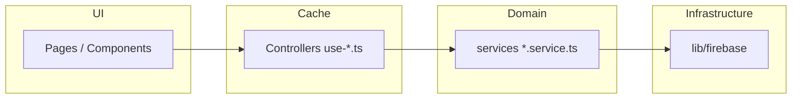

# IRONMIND — Architecture Reference

This document is the **canonical technical overview** for implementing and extending IRONMIND: product intent, runtime stack, folder layout, data flow, Firebase model, caching, UX rules, and **every local skill / rule / doc** agents and developers must follow.

**Audience:** architects, contributors, and AI coding agents operating in Cursor.

---

## 1. Product summary

**IRONMIND** is an elite bodybuilding performance application: rotating training programs, KPI tracking, day-type-aware nutrition, supplement protocols, recovery and physique logging, volume-vs-landmarks analytics, computed **smart alerts**, and a **markdown export** of full athlete state for LLM analysis. Coaching notes are retained as journal data but entered from the **Export** workflow rather than a standalone Coaching page.

The app is built for **multiple independent athletes** (each Firebase Auth user sees only their own data under `users/{uid}/…`). The codebase uses Firebase-backed persistence and a strict **layered architecture** so UI never talks to Firebase directly.

---

## 2. Runtime stack (authoritative)

Versions below are taken from `package.json` at repo root. If `README.md` disagrees (e.g. Next or Tailwind major), **trust `package.json`**.

| Layer           | Technology                                                    |
| --------------- | ------------------------------------------------------------- |
| Framework       | **Next.js 14.2** (App Router), React 18                       |
| Language        | **TypeScript** (strict)                                       |
| Styling         | **Tailwind CSS 3.x**, global tokens in `src/app/globals.css`  |
| Server / cache  | **TanStack Query v5** (`@tanstack/react-query`)               |
| Client UI state | **Zustand**                                                   |
| Backend         | **Firebase** — Auth, Firestore, Storage (`firebase` SDK 12.x) |
| Forms           | React Hook Form + **Zod**                                     |
| Charts          | **Recharts**                                                  |
| Motion          | **Framer Motion**                                             |
| Icons           | **Lucide React**                                              |
| Toasts          | **Sonner**                                                    |
| Date            | **date-fns**                                                  |

**Next.js note:** `AGENTS.md` points agents at `node_modules/next/dist/docs/` because this project’s Next may differ from training cutoffs — read project-local docs before assuming APIs.

---

## 3. Repository layout (high level)

```
ironmind/
├── .cursor/
│   ├── rules/IRONMIND.md          # Enforced agent rules (always applied)
│   ├── skills/                    # Cursor skills (see §15)
│   └── personas/SENIOR-ARCHITECT.md
├── Documentation/
│   ├── README.md                  # Index of docs in this folder
│   ├── ARCHITECTURE.md            # This file
│   ├── STYLE-GUIDE.md             # Current visual implementation guide
│   ├── LOGO-BRIEF.md              # Logo prompts + `public/brand/` asset map
│   └── Data/                      # Archived snippets (see Data/README.md)
├── public/
│   ├── brand/                     # Raster logos — URLs via `brandAssets` (see §13.6)
│   ├── manifest.json
│   └── …
├── src/
│   ├── app/                       # Next.js App Router (pages, layouts, globals)
│   ├── components/                # Shared UI (layout, auth, providers)
│   ├── controllers/               # use*.ts — TanStack Query hooks only
│   ├── services/                  # *.service.ts — domain + Firestore access
│   ├── lib/
│   │   ├── firebase/              # SDK init, converters, helpers
│   │   ├── types/                 # Domain TypeScript models
│   │   ├── constants/             # query keys, stale times, brand assets, domain constants
│   │   ├── seed/                  # Baseline seed + demo roster (`demo-historical`, `demo-data/physique/`, `demo-theme`)
│   │   ├── export/                # Markdown summary generation
│   │   └── utils/                 # dates, formatting, cn(), cycle math, etc.
│   └── stores/                    # Zustand (auth, UI)
├── tailwind.config.js
├── package.json
└── README.md
```

---

## 4. Layered architecture (non-negotiable)

This is the **core contract** of the codebase. It is repeated in `.cursor/rules/IRONMIND.md` and `.cursor/skills/ironmind-data-layer/SKILL.md`.



| Layer                  | Location                          | Responsibility                                                            |
| ---------------------- | --------------------------------- | ------------------------------------------------------------------------- |
| **Pages / components** | `src/app/**`, `src/components/**` | Rendering, UX, wiring **controller hooks** only                           |
| **Controllers**        | `src/controllers/use-*.ts`        | `useQuery` / `useMutation`, cache keys, invalidation, `enabled: !!userId` |
| **Services**           | `src/services/*.service.ts`       | Domain operations; call **`@/lib/firebase`** helpers only                 |
| **Firebase helpers**   | `src/lib/firebase/*`              | Converters, `getDocument`, `queryDocuments`, `collections` paths          |

**Violations to avoid**

- No `import` from `@/services/*` or `@/lib/firebase/*` inside route `page.tsx` / leaf components except where the project already uses an exception (prefer fixing toward the rule).
- Services must not embed React or TanStack Query.
- **All date fields crossing the Firestore boundary are ISO `string`s** after read (converter turns `Timestamp` → ISO string).

**Export pipeline:** `src/lib/export/generate-summary.ts` aggregates by calling **services** (not controllers), suitable for reuse from server-like entry points or hooks that trigger async export.

**Import pipeline:** `src/services/import.service.ts` parses onboarding JSON packs; onboarding UI lives under `src/app/(onboarding)/`. Each run that passes the seeded-user check creates **`users/{uid}/importJobs/{jobId}`** (`status`: `running` → terminal, optional **`compensationApplied`**). Independent paths are grouped into **Firestore `writeBatch` commits** where safe ([`import-firestore-batch.ts`](../src/services/import-firestore-batch.ts)): profile + supplement protocol + volume landmarks in one batch; nutrition plan + seed day + import journal note in one batch; the **first** program / phase on an **empty** `programs` / `phases` subcollection uses a single `batch.set` instead of the multi-doc active-pointer **transaction** (force re-import with existing docs still uses `createProgram` + `setActiveProgram` / `createPhase` + `setActivePhase`). The full coach pack is still **not** one global batch across every domain. On failure after writes began, **`rollbackImportArtifacts`** in [`import-compensation.ts`](../src/services/import-compensation.ts) reverses pushed writes using **`captureImportSnapshots`** (LIFO artifacts). **`jobId`** is on the result (omitted for **`blocked`** pre-check). Re-exported from `src/services/index.ts` for controllers.

**First-login seed:** `src/lib/seed/index.ts` → **`users/{uid}/seedJobs`** with the same compensating pattern and **`SeedUserDataResult`** (`seeded`, `jobId?`) for parity with import observability.

**Weekly volume rollup:** Persisted docs under **`users/{uid}/weeklyVolumeRollups/{weekStart}`** (`WeeklyVolumeRollup` in types) feed **`getWeeklyVolumeSummary`** when present; **`deleteCurrentWeekVolumeRollup`** keeps the card fresh after workout writes (see `use-training.ts` + post-import invalidation).

**Data schema versioning:** `UserData` (`users/{uid}`) may include `dataSchemaVersion` (number). `CURRENT_DATA_SCHEMA_VERSION` is defined in `src/lib/types/index.ts` (currently `1`). Reads should treat a missing field as version `1`. `markUserSeeded` stamps the current constant when import/seed completes cleanly. On any breaking stored-shape change, increment the constant, add migration or read fallbacks, and note the change in this document and `README_DATA_LAYER.md` before shipping writes that depend on the new shape.

---

## 5. Next.js App Router structure

### 5.1 Root

- `src/app/layout.tsx` — Root layout: `globals.css`, `QueryProvider`, Sonner `Toaster`, `dark` class on `<html>`.
- `src/app/page.tsx` — Redirects `/` → `/dashboard`.

### 5.2 Route groups

| Group          | Purpose                                                        |
| -------------- | -------------------------------------------------------------- |
| `(auth)`       | Login / register — unauthenticated flows                       |
| `(onboarding)` | JSON upload / seed path for new users                          |
| `(app)`        | Authenticated shell: sidebar, top bar, mobile nav, `AuthGuard` |

### 5.3 Authenticated shell (`src/app/(app)/layout.tsx`)

- **`AuthGuard`** — Subscribes to Firebase auth; unauthenticated users sent to `/login`; unseeded users redirected to `/onboarding` (with offline/graceful handling).
- **Layout** — Desktop `Sidebar`, `TopBar`, optional-collapsed sidebar margin via `useUIStore`, `MobileNav` fixed bottom on small screens. **DOM order:** sidebar wrapper is **before** the main content wrapper; flyouts that extend past the rail into the content band must not rely on in-`aside` absolute positioning alone (see §13.5).

### 5.4 Page inventory (implemented routes)

Paths below map to `page.tsx` files — **any new `Link` must target one of these** (see IRONMIND routing rule):

| Route                                                                                              | Feature area                                                   |
| -------------------------------------------------------------------------------------------------- | -------------------------------------------------------------- |
| `/dashboard`                                                                                       | Day overview, schedule widgets                                 |
| `/training`, `/training/programs`, `/training/exercises`, `/training/history`, `/training/workout` | Program + session execution                                    |
| `/nutrition`                                                                                       | Day-type macros, meals                                         |
| `/supplements`                                                                                     | Protocol + daily log                                           |
| `/recovery`                                                                                        | Readiness scoring and trends                                   |
| `/physique`                                                                                        | Weight, tape (History table: cm + Δ vs next older row), photos |
| `/settings`                                                                                        | Profile / app settings                                         |
| `/export`                                                                                          | LLM-oriented markdown export                                   |
| `/more`                                                                                            | Mobile “more” hub                                              |
| `/onboarding`                                                                                      | Coach JSON import + seed                                       |
| `/login`, `/register`                                                                              | Auth                                                           |

---

## 6. Client state vs server state

### 6.1 Zustand (`src/stores/`)

- **`auth-store`** — Current Firebase user snapshot, `isAuthenticated`, persisted slice for user identity.
- **`ui-store`** — Shell UX + theme preferences (`AppTheme`: `crimson`, `hot-pink`, `cobalt`, `forge`, `emerald`, `violet`, `custom` with optional `customAccent`), persisted in local storage; not Firestore server data. Also **`dashboardTrendSelectedDate`**: mirrors the dashboard **`PlanByDayStrip`** active calendar day; **`/training`** builds its **14-day-forward** day strip from this anchor (fallback **today**), and updates the store when the user picks a pill on Training so both pages stay in sync.

Use Zustand for **transient UI and auth identity**, not for Firestore document mirrors (those belong in TanStack Query).

### 6.2 TanStack Query (`src/controllers/` + `QueryProvider`)

- **`QueryProvider`** (`src/components/providers/query-provider.tsx`) sets default `gcTime`, merges **`refetchConfig`** from `src/lib/constants/stale-times.ts` (no window-focus refetch by default).
- Each domain exposes hooks such as `useTraining`, `useNutrition`, etc., exported from `src/controllers/index.ts`.

### 6.3 Query keys and staleness

- **Keys:** `src/lib/constants/query-keys.ts` — **`queryKeys(userId)`** factory so every TanStack Query key is **user-scoped** (no cache bleed between accounts). Extend the factory when adding features; never use a global static key array for user data.
- **Stale times:** `src/lib/constants/stale-times.ts` — per-entity tuning (e.g. profile `Infinity`, workouts minutes-level).

---

## 7. Firebase model

### 7.1 Initialization (`src/lib/firebase/config.ts`)

- Reads **`NEXT_PUBLIC_FIREBASE_*`** env vars; if missing, app runs with **no Firebase** (`db`/`auth`/`storage` null) — guards must handle this in dev.
- **IndexedDB persistence** enabled in browser where supported.

### 7.2 Collections helper

All paths go through **`collections`** — never hand-roll `'users/...'` strings (enforced by rules):

| Helper                                 | Path pattern                            |
| -------------------------------------- | --------------------------------------- |
| `collections.users`                    | `users`                                 |
| `collections.profiles(uid)`            | `users/{uid}/profile` (document `data`) |
| `collections.programs(uid)`            | `users/{uid}/programs`                  |
| `collections.workouts(uid)`            | `users/{uid}/workouts`                  |
| `collections.nutritionDays(uid)`       | `users/{uid}/nutrition`                 |
| `collections.supplementLogs(uid)`      | `users/{uid}/supplements`               |
| `collections.supplementProtocol(uid)`  | `users/{uid}/protocol`                  |
| `collections.recoveryEntries(uid)`     | `users/{uid}/recovery`                  |
| `collections.checkIns(uid)`            | `users/{uid}/checkins`                  |
| `collections.phases(uid)`              | `users/{uid}/phases`                    |
| `collections.journalEntries(uid)`      | `users/{uid}/journal`                   |
| `collections.volumeLandmarks(uid)`     | `users/{uid}/landmarks`                 |
| `collections.importJobs(uid)`          | `users/{uid}/importJobs`                |
| `collections.seedJobs(uid)`            | `users/{uid}/seedJobs`                  |
| `collections.weeklyVolumeRollups(uid)` | `users/{uid}/weeklyVolumeRollups`       |

### 7.3 Firestore helpers (`src/lib/firebase/firestore.ts`)

- **`createConverter<T>()`** — Serializes dates to Timestamp on write; reads Timestamps as **ISO strings**.
- Correct **function names:** `getDocument`, `getAllDocuments`, `queryDocuments` — **not** ambiguous names like `getDocuments` (see IRONMIND rules).
- Query constraint arrays typed as **`QueryConstraint[]`** from `firebase/firestore`.
- **`runFirestoreTransaction`**, **`createWriteBatch`**, **`getCollectionCount`** — multi-document invariants, batched writes, and aggregate counts without loading full collections.

**Service telemetry (minimal):** `src/lib/logging/service-write-log.ts` exports **`logServiceWrite`** — one-line JSON to `console` (Vercel log drain). Use for high-risk orchestration (`import`, `seed` failures); do not log PII or tokens.

### 7.4 Storage & auth

- **`src/lib/firebase/storage.ts`** — Upload helpers for physique photos etc. (optional feature flags in app code when Storage is unavailable). Progress photos use a **pending → final** path: bytes land under `users/{uid}/photos/pending/…`, then **`commitPendingStorageUpload`** copies to `users/{uid}/photos/…` and deletes the pending object (so failed commits can drop orphans via `deleteFile` on the pending path). **`listPendingProgressPhotoPaths`** + **`deleteStoragePaths`** support bulk cleanup; **`physique.service`** exposes **`listOrphanPendingProgressPhotos`** / **`deletePendingProgressPhotos`** for hygiene or settings UI.
- **`src/lib/firebase/auth.ts`** — Email/password + **OAuth** (`signInWithPopup`): Google; Facebook and Microsoft helpers exist and may be hidden in UI until provider console setup is complete.

**Risk acceptance — client uploads (physique photos):** There is **no server-side malware scanning** or content inspection in the current pipeline; uploads are **owner-only** per `storage.rules`, feature-gated (`NEXT_PUBLIC_ENABLE_PHOTO_UPLOAD`), and stored as **opaque blobs**. That matches the product scope today (trusted athlete, small images). If the threat model changes (e.g. shared devices, untrusted packs, or server-side processing), add an explicit gate (Cloud Function + scanner, signed upload URLs with metadata checks, or a third-party pipeline) **before** widening who can upload or what runs on uploaded bytes.

### 7.5 Client-side API contract (no HTTP layer)

There is no `src/app/api/**` route surface today: the **contract** is **TypeScript service signatures** + **Firestore document shapes** + **`storage.rules` / `firestore.rules`**.

- **Schema evolution:** `UserData.dataSchemaVersion` and **`CURRENT_DATA_SCHEMA_VERSION`** in `src/lib/types/index.ts`. When persisted shapes break backward compatibility, **increment the constant**, add read fallbacks or a one-time migration in the owning service, and note the bump in this file + `README_DATA_LAYER.md` before shipping writers that depend on the new shape.

---

## 8. Domain modules (services ↔ controllers ↔ UI)

Exported services (`src/services/index.ts`): profile, training, nutrition, recovery, physique, supplements, coaching, volume, alerts, **dashboard** (composite reads for the shell), storage.

| Domain      | Service                   | Representative controller hooks | Primary UI                                                            |
| ----------- | ------------------------- | ------------------------------- | --------------------------------------------------------------------- |
| Profile     | `profile.service.ts`      | `use-profile`                   | Settings, dashboard header                                            |
| Training    | `training.service.ts`     | `use-training`                  | Training pages, workout                                               |
| Nutrition   | `nutrition.service.ts`    | `use-nutrition`                 | Nutrition                                                             |
| Recovery    | `recovery.service.ts`     | `use-recovery`                  | Recovery                                                              |
| Physique    | `physique.service.ts`     | `use-physique`                  | Physique                                                              |
| Supplements | `supplements.service.ts`  | `use-supplements`               | Supplements                                                           |
| Coaching    | `coaching.service.ts`     | `use-coaching`                  | Export note composer (journal-backed); no dedicated `/coaching` route |
| Volume      | `volume.service.ts`       | `use-volume`, `use-dashboard`   | Dashboard charts, landmarks                                           |
| Alerts      | `alerts.service.ts`       | `use-alerts`                    | Dashboard / notifications                                             |
| Export      | (summary in `lib/export`) | `use-export`                    | Export page                                                           |

**Alert cache contract:** `getActiveAlerts` is pure derivation over training, recovery, physique, supplements, etc. **`useActiveAlerts`** (`src/controllers/use-alerts.ts`) caches under **`queryKeys(userId).alerts.active()`** with **`staleTimes.alerts`** (5 minutes in `stale-times.ts`). The shell **top bar** uses `useActiveAlerts` directly, while **`getDashboardBundle`** also embeds alerts for the dashboard page — those are **separate** TanStack trees. **`invalidateDashboardBundle`** (`invalidate-dashboard.ts`) therefore invalidates **both** `[userId, 'dashboard']` and **`queryKeys(userId).alerts.all`**, so any mutation that already refreshed the bundle (workouts, nutrition, recovery, …) also refetches top-bar alerts instead of waiting for the 5‑minute stale window. **Session dismiss:** the top bar may **filter out** alerts the user dismissed in **`sessionStorage`** for that browser session — that is a **presentation overlay** only; it does not change Firestore or invalidate alert queries.

**`getActiveAlerts` inputs:** Tabulated at the top of [`alerts.service.ts`](../src/services/alerts.service.ts) — update when adding a branch.

**Multi-active recovery:** `getActiveProgram` / `getActivePhase` use `limit(1)`; multiple `isActive: true` rows yield an arbitrary winner until repaired. Idempotent **`repairMultipleActivePrograms`** (`training.service.ts`) and **`repairMultipleActivePhases`** (`coaching.service.ts`) pick a single winner (newest `updatedAt`, then `startDate` / `id`) and reuse the existing transactional **`setActiveProgram`** / **`setActivePhase`**. Not run on every read — call from support tooling or a future Settings repair action.

**Derived persisted fields (recompute ownership):** **`readinessScore`** on recovery entries is stamped on write in **`recovery.service`** via **`calculateReadinessScore`**. **`complianceScore`** on nutrition days is recomputed in **`nutrition.service`** when saving a day. Supplement log **`compliancePercent`** is owned by **`supplements.service`** save paths. New code paths that persist these documents must reuse the same helpers or document an explicit exception.

**Journal bounded scans:** [`coaching.service.ts`](../src/services/coaching.service.ts) — `DEFAULT_JOURNAL_LIST_LIMIT` (200), `JOURNAL_SEARCH_SCAN_LIMIT` (500), `JOURNAL_SEARCH_WINDOW_DAYS` (120), `JOURNAL_TAGS_WINDOW_DAYS` (180). Search/tag features are **best-effort within the window** by design; raising limits requires index and product review.

---

## 9. Types (`src/lib/types/index.ts`)

Single umbrella module for domain entities: `AthleteProfile`, `Program`, `Workout`, `NutritionDay`, `SmartAlert`, etc.

**SmartAlert.type** allowed values are fixed in types — must stay in sync with `alerts.service.ts` (see IRONMIND rule).

---

## 10. Seed data and onboarding

### 10.1 Automatic seed (`src/lib/seed/index.ts`)

`seedUserData(userId)` runs once when the user has no seed flag. It creates a **`seedJobs`** document (`running` → `success` | `failed`), uses **`captureImportSnapshots`** / **`rollbackImportArtifacts`** on failure (same helpers as coach import), and returns **`SeedUserDataResult`** (`seeded`, `jobId?`).

1. Profile (`mortonProfile`)
2. Program + active program (`mortonProgram`)
3. Supplement protocol
4. Phase + active phase
5. Volume landmarks
6. Nutrition placeholder for **today** via `saveNutritionDay`
7. Initial journal notes (used by export when coaching notes are included)
8. **`markUserSeeded`**

**Rule:** Any new `src/lib/seed/*.ts` file must be imported into `seed/index.ts`, invoked inside `seedUserData()`, and log **`✓`** lines on success (IRONMIND.md).

### 10.2 Coach JSON import (`import.service.ts` + onboarding UI)

`collections.importJobs(uid)` is the subcollection path for per-run job documents (see **Import pipeline** above).

Structured JSON files (e.g. `athlete_profile.json`, `training_program.json`, …) are validated, merged into `ParsedCoachData`, then persisted through the same services as seed data. Valid **`YYYY-MM-DD`** `startDate` values on **`training_program.json`** and **`phase.json`** are written as-is; otherwise import stamps **today** (`calendarDateOr` in `import.service.ts`).

Current onboarding flow is **6 steps**:

1. Overview
2. Theme selection (`crimson`, `hot-pink`, `cobalt`, `forge`, `emerald`, `violet`, `custom`)
3. Coach prompt
4. Questionnaire
5. Data generation + analysis guidance
6. Import

### 10.3 Demo roster overwrite (`seed*Data` + `demo-historical.ts`)

Six alternate personas (`seedMortonData` … `seedMariaData` in `src/lib/seed/index.ts`, chosen from `DemoProfileModal`) overwrite baseline domains and call **`seedDemoHistoricalData`**, which **`deleteAllCheckIns`** then writes **twelve** weekly physique points from **`src/lib/seed/demo-data/physique/`** (per-persona TypeScript literals) across the same **`DEMO_HISTORY_DAYS`** window as daily synthetic logs (**`personaTuning`**). Demo **UI theme** mapping is **`src/lib/seed/demo-theme.ts`**; `DemoProfileModal` sets theme after seed, and **`DemoThemeSync`** reapplies it when `clientName` matches a demo athlete. Canonical narrative: **`Documentation/EXPERT-DEMO-DATA-AND-STORAGE-GUIDE.md`**.

---

## 11. Alerts architecture (`src/services/alerts.service.ts`)

`getActiveAlerts(userId)` aggregates rule checks (shoulder spillover, day-13 fatigue, calorie emergency, progression, recovery, supplement compliance, etc.).

**Invariant:** Every `check*` function must be referenced from `getActiveAlerts()` — no orphaned checks (IRONMIND.md).

**Input catalog:** See the file-level table in `alerts.service.ts` (principal review) — it lists each alert branch and the underlying service reads so invalidation and future tests stay traceable.

---

## 12. Export architecture (`src/lib/export/`)

`generateSummary(userId, ExportOptions)` pulls parallel data via services and emits a single **markdown** report for external LLM consumption. Options select sections (profile, program, workouts, nutrition, …) and history depth.

`/export` also contains a **persisted note composer** that writes journal entries via `useCreateJournalEntry`; these entries are included in output when `includeCoachingNotes` is enabled.

---

## 13. UI system (tokens, layout, accessibility of rules)

### 13.1 Canonical sources (priority order)

1. **CSS variables** in `src/app/globals.css`
2. **Tailwind theme** in `tailwind.config.js` (`bg-bg-2`, `text-text-0`, `crimson`, etc.)
3. Raw bracket colors **only** when no token exists

### 13.2 Agent rules affecting UI

From `.cursor/rules/IRONMIND.md`:

- **Numeric data** uses `font-mono tabular-nums`
- **Crimson accent** is scarce — CTAs, active nav, PRs, key badges (not body copy)
- **Glass panels** — `.glass-panel` / `.glass-panel-strong` patterns; panel border width driven by CSS variables (e.g. `--panel-border-width`)
- **Interactive panels** — `.glass-panel` hover/focus-within transitions to accent border + glow
- **Accordion** — Expandable content uses `.accordion-wrapper` + `.accordion-inner` (CSS grid-row animation)
- **Page titles** — h1 elements use `text-[color:var(--accent)]` for branded identity; body text, bold, section headings inside panels use `--text-0` (white) for readability
- **iOS spinner** — `.spinner` class is iOS-style conic gradient; prefer over `.skeleton` for loading
- **LED indicators** — Knight Rider-style readiness/weight bars in top bar with themed pulse
- **Mobile nav** — active indicator is `absolute`; parent `Link` must be `relative`

### 13.3 `Documentation/STYLE-GUIDE.md`

`STYLE-GUIDE.md` now tracks the live visual baseline (tokens, selected-state rules, onboarding theme behavior). If any table drifts, implementation still defers to **`globals.css`**, **`tailwind.config.js`**, and the **ironmind-styling** / **ironmind-visual-persona** skills.

### 13.4 Dashboard layout & exercise list readability

- **Overview shell:** The authenticated dashboard wraps its primary content in **`.dashboard-overview`** (`globals.css`). It is **horizontally centered** (`max-width` + auto margins) with **rounded corners** (`1.25rem`) and a subtle warm-dark translucent fill. `.dashboard-overview` uses the same panel border system as `.glass-panel`: subtle resting border (6% accent), accent glow on hover/focus-within, 1px border width.
- **Trend window:** Dashboard charts for training density and physique minis respect a user-selected **date range** (week presets + custom **from–to**) via shared dashboard state. **Week presets (1–4 wk)** run **forward** from **`Program.startDate`** (cycle day 1 anchor), inclusive for `N` calendar days — not backward from today. Custom range is unchanged (explicit from/to). Extend controllers with `enabled` / bounded queries when adding new range-driven widgets.
- **Trend day strip:** One tab per calendar day in the active trend bounds. **Session** for the selection uses `getCycleDay(program.startDate ?? today, selectedDate, cycleLength)`. **Logged day data** uses the same per-date controller pattern as domain pages: **`useNutritionDay`**, **`useRecoveryEntry`**, **`useSupplementLog`** keyed by the selected `yyyy-MM-dd` (not only the dashboard bundle’s “today” slice). **`useDashboardData`** supplies profile, program, weekly volume, and the initial shell load; it is fetched early enough to feed trend `from`/`to` from **`activeProgram.startDate`**. **Week 1 start** is user-editable (`useUpdateProgram` + `ProgramCycleStartControl` on dashboard and training).
- **Today's schedule:** Non-workout items (meals, vitamins, activities) use **icon-forward** type chips (accent-themed), not unrelated rainbow pills. **No row-hover duplicate portal** over the plan table — visible columns carry time, type, item, and description; use row **click** for the detail modal when needed.
- **Ordered exercises:** Row indices use **`.exercise-index-badge`** — **dark tile + primary text + thin accent border**. Avoid **grey-on-saturated-accent** number chips (low contrast); follow **`IRONMIND.md`** and the **ironmind-styling** skill.

### 13.5 App chrome (header, sidebar, mobile nav)

Persistent layout chrome uses the same **warm dark** token hierarchy as the rest of the app — not flat `#2e2e2e`-style cool grey bars.

- **Tokens** (`globals.css` `:root`): `--chrome-bg` (sidebar & mobile nav, matches `--bg-1`), `--chrome-bg-topbar` (sticky header — **same value as `--chrome-bg`** so header and sidebar share one shade), `--chrome-bg-toggle` (sidebar rail control, matches `--bg-0`).
- **Components:** `top-bar.tsx`, `sidebar.tsx`, `mobile-nav.tsx` — backgrounds via `bg-[color:var(--chrome-…)]`; idle/hover chrome text via `var(--text-1)` / `var(--text-0)` (see **`.cursor/rules/IRONMIND.md`**).
- **Collapsed sidebar nav peeks + plan-by-day strip peeks:** Optional **title + hint** for sighted users only — **`aria-hidden`** on the peek, combined **`aria-label`** on each **`Link`** when the rail is icon-only. **Shared UI:** **`PEEK_CAPTION_PANEL_SKIN`** (fill/shadow/padding) + **`globals.css`** layout classes — **`.sidebar-rail-peek-panel`** / **`.plan-day-strip-peek-panel`** (**216px** wide, **theme accent border** via plain CSS `border-color: color-mix(in srgb, var(--accent) 62%, transparent)` matching **`.nav-item.active`**, centered copy; intrinsic height). Sidebar peeks are **`createPortal` → `document.body`** with **`position: fixed`** and **`getBoundingClientRect()`** so they are not clipped by **`nav`**’s vertical scroll or painted under the **main** column (layout sibling order). Day-strip peeks stay **`absolute`** above pills. **Expand/collapse** control: short **`aria-label`** only; no second decorative hover card on the chevron.
- **LED indicators:** The top bar's Knight Rider-style LED readiness and weight bars replace the old numeric readiness display and profile section. Two synced pulse-animated bars with hover tooltips, themed via accent CSS variables.
- **Alerts bell:** Persists beside the LEDs; **active** alert count sets accent emphasis / badge; **session dismiss** hides rows client-side without a server write.

### 13.6 Brand imagery (logos)

- **On disk:** All raster logo PNGs live under **`public/brand/`** (male, female, combined mark, Apple touch icon, optional alternate crops).
- **In code:** **`src/lib/constants/brand-assets.ts`** exports **`brandAssets`** — the only supported way to reference those URLs (`brandAssets.logoMale`, `logoFemale`, `logoCombined`, `appleTouchIcon`, alternates).
- **Components:** **`IronmindLogo`** (`src/components/brand/ironmind-logo.tsx`) picks male vs female PNG by UI theme (hot-pink → female). **`/login`** uses the **combined** mark directly via `brandAssets.logoCombined`.
- **Full asset list and prompts:** **`Documentation/LOGO-BRIEF.md`**.

### 13.7 Shared selected-state styling

- **Utility class:** `.is-selected` in `src/app/globals.css`.
- **Purpose:** Keep selected buttons, tabs, and cards synchronized with one theme-driven glow/border treatment.
- **Applied in:** dashboard days-in-range strip + selected session card, nutrition day-type selector, recovery log/trends tab switcher, and selected demo profile tiles during onboarding.

---

## 14. Quality gates and workflows

| Gate              | Command / action                                                                |
| ----------------- | ------------------------------------------------------------------------------- |
| **Full CI chain** | `npm run ci` — lint + typecheck + build (matches GitHub Actions)                |
| Typecheck         | `npx tsc --noEmit` or `npm run typecheck` — **zero errors** policy              |
| Lint              | `npm run lint` — ESLint with `--max-warnings=0`                                 |
| Format            | `npm run format` (check) or `npm run format:fix` (auto-fix) — Prettier          |
| Pre-commit hook   | `simple-git-hooks` + `lint-staged` — auto-fixes lint + prettier on staged files |
| Architecture      | No page → service/firebase shortcuts                                            |
| Routing           | All `href`s resolve to existing `page.tsx`                                      |
| Seed              | Seed files wired and logged                                                     |
| Alerts            | All checks wired into `getActiveAlerts`                                         |
| Deploy            | `npm run publish` — CI verification → push → Vercel auto-deploys                |

**CI runs automatically** on every push to `main` and every pull request via `.github/workflows/ci.yml`. See `README_CICD.md` for the full pipeline architecture.

---

## 15. Required reading for implementers (skills & docs)

Use this table when planning work — **read the relevant skill before coding**.

| Skill / doc                            | Path                                                   | Use when                                                                                                 |
| -------------------------------------- | ------------------------------------------------------ | -------------------------------------------------------------------------------------------------------- |
| **IRONMIND rules**                     | `.cursor/rules/IRONMIND.md`                            | **Always** — design tokens, routing, Firebase names, alerts, seed, CSS import order, CI pre-merge checks |
| **Data layer**                         | `.cursor/skills/ironmind-data-layer/SKILL.md`          | New features, controllers, services, mutations, cache keys                                               |
| **Firebase patterns**                  | `.cursor/skills/ironmind-firebase-patterns/SKILL.md`   | Firestore queries, converters, auth, constraints, committed rules + CI deploy flow                       |
| **TypeScript patterns**                | `.cursor/skills/ironmind-typescript-patterns/SKILL.md` | Types, imports, strict patterns, `npm run ci` chain                                                      |
| **CI/CD & platform**                   | `.cursor/skills/ironmind-cicd/SKILL.md`                | Deploy, Vercel/Firebase CLI, env vars, MCP, rollback, observability                                      |
| **Styling**                            | `.cursor/skills/ironmind-styling/SKILL.md`             | Buttons, cards, panels, typography                                                                       |
| **Visual persona**                     | `.cursor/skills/ironmind-visual-persona/SKILL.md`      | Brand, crimson discipline, forbidden colors                                                              |
| **Animations**                         | `.cursor/skills/ironmind-animations/SKILL.md`          | Motion, loading, hover                                                                                   |
| **Senior architect persona**           | `.cursor/personas/SENIOR-ARCHITECT.md`                 | System-level decisions, review mindset, build/release hygiene                                            |
| **CI/CD persona**                      | `.cursor/personas/CICD-SCALING-CONSULTANT.md`          | Platform, MCP, scaling, monitoring, DevOps mindset                                                       |
| **Next.js agent note**                 | `AGENTS.md`                                            | Next.js behavior differences — consult `node_modules/next/dist/docs/`                                    |
| **This architecture doc**              | `Documentation/ARCHITECTURE.md`                        | Orientation, boundaries, Firestore map                                                                   |
| **Data layer narrative**               | `README_DATA_LAYER.md`                                 | Three-layer rationale, cache strategy, why this matters                                                  |
| **UI/UX narrative**                    | `README_UIUX.md`                                       | Design tokens, motion, accessibility, polish narrative                                                   |
| **CI/CD narrative**                    | `README_CICD.md`                                       | Environments, MCP, pipeline, secrets, rollback, scaling                                                  |
| **DevOps Control Center**              | `.cursor/plans/DEVOPS_CONTROL_CENTER.md`               | Live task list with exact commands — tick items as completed                                             |
| **Implementation review (2026-04-21)** | `Documentation/IMPLEMENTATION-REVIEW-2026-04-21.md`    | Request-to-delivery trace for current UI/UX retrofit                                                     |
| **Documentation index**                | `Documentation/README.md`                              | Which doc to read for what                                                                               |
| **Logo brief & assets**                | `Documentation/LOGO-BRIEF.md`                          | Brand prompts, `public/brand/` files, `brandAssets`                                                      |

---

## 16. Environment variables

**Three-environment separation:**

| Environment           | Source                          | Pulled via                                                   | Used by                  |
| --------------------- | ------------------------------- | ------------------------------------------------------------ | ------------------------ |
| **Local (dev)**       | `.env.local` (git-ignored)      | `cp .env.example .env.local` or `vercel env pull .env.local` | `npm run dev`            |
| **Preview (per PR)**  | Vercel project → Preview env    | Vercel injects automatically                                 | Vercel preview builds    |
| **Production (main)** | Vercel project → Production env | Vercel injects automatically                                 | Vercel production builds |

**Required Firebase variables** (all `NEXT_PUBLIC_*` — client-safe):

- `NEXT_PUBLIC_FIREBASE_API_KEY`
- `NEXT_PUBLIC_FIREBASE_AUTH_DOMAIN`
- `NEXT_PUBLIC_FIREBASE_PROJECT_ID`
- `NEXT_PUBLIC_FIREBASE_STORAGE_BUCKET`
- `NEXT_PUBLIC_FIREBASE_MESSAGING_SENDER_ID`
- `NEXT_PUBLIC_FIREBASE_APP_ID`

**Feature flags:**

- `NEXT_PUBLIC_ENABLE_PHOTO_UPLOAD` — set to `true` only when Firebase Storage is provisioned (Blaze plan)

Without these, Firebase initialization is skipped (`isMockMode` in `config.ts`). GitHub Actions requires the six Firebase keys as **GitHub Secrets** (mirroring Vercel production) for the build step.

See `README_CICD.md` for the full secrets management strategy and `.cursor/skills/ironmind-cicd/SKILL.md` for CLI operations.

---

## 17. How to add a new feature (checklist)

1. **Domain type** — Add/adjust interfaces in `src/lib/types/index.ts`.
2. **Firestore** — If new collections are needed, extend `collections` in `config.ts` and document security rules in `firestore.rules` (CI deploys on merge to `main`).
3. **Service** — Add functions in `src/services/<domain>.service.ts` with explicit return types.
4. **Controller** — Add `useQuery`/`useMutation` hooks in `src/controllers/use-<domain>.ts`; register keys in `query-keys.ts` and `stale-times.ts`.
5. **UI** — Add route under `src/app/(app)/.../page.tsx`; use controller hooks only; implement loading / error / empty states (IRONMIND completeness).
6. **Seed / import** — If default data is required, update `lib/seed` **and** `seedUserData()`.
7. **Alerts** — If new alert types, extend `SmartAlert` union **and** `getActiveAlerts` wiring.
8. **Verify locally** — `npm run ci` (lint + typecheck + build).
9. **Verify mobile** — Chrome DevTools → 375px width.
10. **Commit & push** — Pre-commit hook auto-fixes lint + prettier.
11. **Deploy** — `npm run publish` (runs CI → pushes → Vercel auto-deploys).

---

## 18. Glossary (domain)

| Term          | Meaning                                                       |
| ------------- | ------------------------------------------------------------- |
| **Cycle day** | Position in the N-day rotating program (e.g. 14-day)          |
| **Day type**  | Recovery / moderate / high / highest — drives macro templates |
| **Landmarks** | MV / MEV / MAV / MRV volume bands per muscle                  |
| **KPI**       | Key lifts tracked across the cycle (e.g. DB bench, pull-ups)  |

---

_Document version follows the repository; when in doubt, verify against source files cited above._
