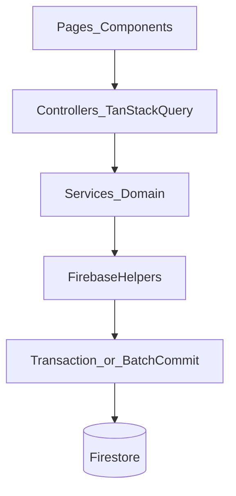

# Principal-Level Data Review — IRONMIND

Date: 2026-04-23

Scope: Data modeling, storage, business logic, API contract surface, reliability, and performance for the current Firebase + TanStack Query architecture, with UX trust/speed as first-order constraints.

**Document status:** This file is the **canonical checklist** for data-layer hardening. **Historical** subsections (2026-04-23 baseline) remain for context; **implementation status** below and _Shipped_ callouts describe what has landed since. Re-verify any cited line numbers against the repo after large refactors.

## Implementation status (post-review)

| Area                                                                                                                            | Status                                                                                                                                                                                                                                                                                                                                                                                                                 |
| ------------------------------------------------------------------------------------------------------------------------------- | ---------------------------------------------------------------------------------------------------------------------------------------------------------------------------------------------------------------------------------------------------------------------------------------------------------------------------------------------------------------------------------------------------------------------- |
| `runFirestoreTransaction` / `createWriteBatch` / `getCollectionCount`                                                           | **Shipped** — [`src/lib/firebase/firestore.ts`](../src/lib/firebase/firestore.ts)                                                                                                                                                                                                                                                                                                                                      |
| Active program/phase toggles in one Firestore transaction                                                                       | **Shipped** — [`training.service.ts`](../src/services/training.service.ts), [`coaching.service.ts`](../src/services/coaching.service.ts)                                                                                                                                                                                                                                                                               |
| `getActiveProgram` uses `limit(1)`                                                                                              | **Shipped**                                                                                                                                                                                                                                                                                                                                                                                                            |
| Bounded physique / volume trend / journal date windows + index IDs                                                              | **Shipped** — deploy indexes: `npm run deploy:indexes`                                                                                                                                                                                                                                                                                                                                                                 |
| Dashboard single `useQuery` bundle + invalidation helper                                                                        | **Shipped** — [`dashboard.service.ts`](../src/services/dashboard.service.ts), [`use-dashboard.ts`](../src/controllers/use-dashboard.ts)                                                                                                                                                                                                                                                                                |
| Narrow post-import / mutation invalidation                                                                                      | **Shipped** — [`invalidate-user-domains.ts`](../src/controllers/_shared/invalidate-user-domains.ts), [`invalidate-dashboard.ts`](../src/controllers/_shared/invalidate-dashboard.ts)                                                                                                                                                                                                                                   |
| Shell **alert** query co-invalidated with dashboard bundle                                                                      | **Shipped** — [`invalidate-dashboard.ts`](../src/controllers/_shared/invalidate-dashboard.ts) also invalidates **`queryKeys(userId).alerts.all`** so **`useActiveAlerts`** (top bar) refetches with the same mutations that call **`invalidateDashboardBundle`**                                                                                                                                                       |
| Mutation errors → Sonner toasts                                                                                                 | **Shipped** — [`on-error.ts`](../src/controllers/_shared/on-error.ts)                                                                                                                                                                                                                                                                                                                                                  |
| `applyWorkoutSetChange` + `CONFLICT` / `updatedAt` guard                                                                        | **Shipped** — [`training.service.ts`](../src/services/training.service.ts)                                                                                                                                                                                                                                                                                                                                             |
| `ImportResult.completion`                                                                                                       | **Shipped** — [`import.service.ts`](../src/services/import.service.ts)                                                                                                                                                                                                                                                                                                                                                 |
| `dataSchemaVersion` / `CURRENT_DATA_SCHEMA_VERSION`                                                                             | **Shipped** — [`types`](../src/lib/types/index.ts), [`profile.service.ts`](../src/services/profile.service.ts), ARCHITECTURE                                                                                                                                                                                                                                                                                           |
| Import **compensating rollback** + **`importJobs`** audit (`running` → terminal, `compensationApplied?`) + `ImportResult.jobId` | **Shipped** — [`import.service.ts`](../src/services/import.service.ts), [`import-compensation.ts`](../src/services/import-compensation.ts), `collections.importJobs` — **grouped `writeBatch`** for independent paths ([`import-firestore-batch.ts`](../src/services/import-firestore-batch.ts)); full pack is still **not** one global batch; failures after writes trigger **LIFO artifact rollback** + job metadata |
| `seedUserData` **`seedJobs`** + same compensating rollback as import                                                            | **Shipped** — [`src/lib/seed/index.ts`](../src/lib/seed/index.ts), `collections.seedJobs`, returns **`SeedUserDataResult`** (`seeded`, `jobId?`)                                                                                                                                                                                                                                                                       |
| Persisted weekly **volume rollup** docs + read path + invalidation                                                              | **Shipped** — [`weeklyVolumeRollups`](../src/lib/firebase/config.ts) + [`volume.service.ts`](../src/services/volume.service.ts) (`getWeeklyVolumeSummary` uses rollup when present); **`deleteCurrentWeekVolumeRollup`** from workout mutations + post-import invalidation                                                                                                                                             |
| Pending photo **list / bulk delete** (orphan hygiene API)                                                                       | **Shipped** — [`listOrphanPendingProgressPhotos`](../src/services/physique.service.ts), [`deletePendingProgressPhotos`](../src/services/physique.service.ts), [`listPendingProgressPhotoPaths`](../src/lib/firebase/storage.ts)                                                                                                                                                                                        |
| **Client-upload risk acceptance** (no malware scan)                                                                             | **Documented** — [`ARCHITECTURE.md`](./ARCHITECTURE.md) §7.4 _Risk acceptance — client uploads_                                                                                                                                                                                                                                                                                                                        |
| Automated tests (Vitest / emulator)                                                                                             | **Not in repo** — deferred until you choose a runner and CI policy                                                                                                                                                                                                                                                                                                                                                     |
| Upload pending → finalize (Storage)                                                                                             | **Shipped (initial)** — [`commitPendingStorageUpload`](../src/lib/firebase/storage.ts) + [`uploadProgressPhoto`](../src/services/physique.service.ts) uses `photos/pending` then commit                                                                                                                                                                                                                                |
| Structured telemetry (`logServiceWrite`)                                                                                        | **Shipped (initial)** — [`service-write-log.ts`](../src/lib/logging/service-write-log.ts); import + seed failure paths                                                                                                                                                                                                                                                                                                 |
| Multi-active **repair** (`repairMultipleActivePrograms`, `repairMultipleActivePhases`)                                          | **Shipped (on-demand)** — [`training.service.ts`](../src/services/training.service.ts), [`coaching.service.ts`](../src/services/coaching.service.ts); not auto-invoked; see ARCHITECTURE §8                                                                                                                                                                                                                            |
| **`getActiveAlerts` input catalog**                                                                                             | **Shipped** — table at top of [`alerts.service.ts`](../src/services/alerts.service.ts); cross-linked in ARCHITECTURE §8 / §11                                                                                                                                                                                                                                                                                          |
| Derived-field **recompute ownership** + journal scan constants                                                                  | **Documented** — ARCHITECTURE §8 (_Derived persisted fields_, _Journal bounded scans_)                                                                                                                                                                                                                                                                                                                                 |
| Client **API contract** (no routes; schema bump policy)                                                                         | **Documented** — ARCHITECTURE §7.5                                                                                                                                                                                                                                                                                                                                                                                     |

---

## Data Modeling

### Executive Verdict

The core domain model is coherent and strongly typed in [`src/lib/types/index.ts`](../src/lib/types/index.ts). **At review time**, active toggles and import orchestration were procedural; **since Apr 2026**, active program/phase toggles use **Firestore transactions**, Firebase helpers expose **`runFirestoreTransaction`** / **`createWriteBatch`**, coach **import** batches independent writes per [`import-firestore-batch.ts`](../src/services/import-firestore-batch.ts), on-demand **multi-active repair** exists, and **derived-field ownership** is documented in ARCHITECTURE. **Still open:** optional **seed** `writeBatch` grouping (same style as import — `seedJobs` + rollback today); automated **tests** when a runner is chosen.

### Risks Found

1. **~~Critical — Non-atomic active entity toggles~~ → Shipped**
   - `setActiveProgram` / `setActivePhase` now run inside **`runFirestoreTransaction`** (read all program/phase refs, then apply `isActive` updates atomically). _Residual:_ rules cannot enforce “exactly one active” across a collection; corruption from legacy data still possible until repaired.
2. **High — Active reads can hide inconsistent data** _(partially mitigated)_
   - **`getActiveProgram`** now uses **`limit(1)`**. `getActivePhase` already used `limit(1)`; multiple active rows still yield an arbitrary winner until **`repairMultipleActivePrograms`** / **`repairMultipleActivePhases`** are run (on-demand; not wired to every read).
3. **~~Critical — Partial import state~~ → Mitigated (compensating + grouped batches)** — Independent import paths (profile/protocol/landmarks; nutrition plan+day+journal; first-only program/phase) commit in **`writeBatch`** chunks where feasible; remaining steps still cross batch boundaries. On failure after writes began, **`rollbackImportArtifacts`** runs (see [`import-compensation.ts`](../src/services/import-compensation.ts)); **`importJobs`** records `compensationApplied`. _Residual:_ rollback itself can fail (surfaced as an extra error); a **single** Firestore batch for the entire coach pack is still not a client-side guarantee.
4. **~~High — Seed orchestration parity gap~~ → Shipped** — **`seedUserData`** uses **`seedJobs`** + the same snapshot/rollback helpers as import ([`seed/index.ts`](../src/lib/seed/index.ts)).
5. **Medium — Derived field drift** _(ownership documented)_
   - Computed fields (`readinessScore`, `complianceScore`, supplement compliance) rely on specific write paths and may diverge if alternate paths bypass recomputation — see ARCHITECTURE §8 _Derived persisted fields_; new paths must reuse the same helpers.

### User Impact

- Users can see conflicting “active” entities, stale dashboards, or mismatched plan/phase state after intermittent failures.
- Import can still surface per-file errors, but compensating rollback aims to avoid “mostly done” **persisted** gaps when a later step fails.
- Mobile/weak-network users are disproportionately exposed to mid-operation failure states.

### Technical Cause

- **Historical (pre-fix):** Active toggles were read-modify-write loops (sequential `updateProgram` / `updatePhase` calls), so a failure mid-loop could leave multiple `isActive: true` rows.
- **Current:** Implementations use **`runFirestoreTransaction`**: all active flags for the collection are read and written in one commit. See `setActiveProgram` / `setActivePhase` in [`training.service.ts`](../src/services/training.service.ts) and [`coaching.service.ts`](../src/services/coaching.service.ts).
- The Firebase helper surface in [`src/lib/firebase/firestore.ts`](../src/lib/firebase/firestore.ts) now includes **`runFirestoreTransaction`**, **`createWriteBatch`**, and **`getCollectionCount`** (re-exported transaction/batch types as needed).
- **Import writes:** **`import-firestore-batch.ts`** for atomic subsets; then program/phase steps (transactional active toggles when existing docs); **artifact stack** + **`captureImportSnapshots`**; on error, **`rollbackImportArtifacts`** reverses pushed writes where possible ([`import.service.ts`](../src/services/import.service.ts), [`import-compensation.ts`](../src/services/import-compensation.ts)).
- **Import vs seed flag nuance:** `importCoachData()` only calls `markUserSeeded` when `errors.length === 0` **after** rollback attempts. If rollback fully succeeds, the user typically remains unseeded with no partial domain state; if rollback fails, both errors are surfaced and the job records `compensationApplied` when rollback ran.

### Recommended Fix

1. ~~**Introduce transaction/batch primitives in Firebase helper layer**~~ **Done** — `runFirestoreTransaction`, `createWriteBatch`, `getCollectionCount` in [`firestore.ts`](../src/lib/firebase/firestore.ts).
2. ~~**Refactor active toggles to transactional invariants**~~ **Done** — single transaction per toggle in training/coaching services.
3. ~~**Add explicit import consistency contract**~~ **Done (compensating + `importJobs` + grouped `writeBatch`)** — optional future: one **global** batch for the entire coach pack if product ever requires it (unlikely vs. rollback + jobs).
4. ~~**Document first-login seed failure semantics**~~ **Done** — `seedJobs` + shared rollback; JSDoc on `seedUserData`.

Acceptance criteria:

- After any successful active-toggle call, there is exactly one active document.
- Concurrent active-toggle calls do not produce multiple active docs.
- Import failure leaves the user in **unchanged domain state** when compensating rollback succeeds, with **`importJobs`** + errors for support; explicit failed state when rollback cannot complete.
- Architecture docs describe invariant ownership and rollback behavior.

### UX/UI Impact

- Improves visible consistency for dashboard, training, and phase-specific pages.
- Reduces trust-breaking state discrepancies without introducing UX latency if mutations are properly disabled/debounced during transaction retries.
- Improves weak-network behavior by making error states explicit and recoverable.

### Priority

- **Critical:** Active toggle atomicity; ~~import atomicity contract~~ **compensating import shipped** + **`import-firestore-batch`** — optional **single global** batch remains future-only.
- **Low:** Optional **seed** `writeBatch` grouping mirroring import (nice-to-have; rollback + `seedJobs` already shipped).
- **Low:** Extend **`logServiceWrite`** beyond import/seed as high-risk domains are identified.

### Implementation Notes

- Files:
  - [`src/lib/firebase/firestore.ts`](../src/lib/firebase/firestore.ts)
  - [`src/services/training.service.ts`](../src/services/training.service.ts) — includes **`repairMultipleActivePrograms`**
  - [`src/services/coaching.service.ts`](../src/services/coaching.service.ts) — includes **`repairMultipleActivePhases`**
  - [`src/services/import.service.ts`](../src/services/import.service.ts)
  - [`src/lib/seed/index.ts`](../src/lib/seed/index.ts)
  - [`src/services/alerts.service.ts`](../src/services/alerts.service.ts) — **`getActiveAlerts`** input catalog
- Sequence:
  1. ~~Add helper primitives.~~ **Done**
  2. ~~Refactor active toggles.~~ **Done**
  3. ~~Harden import.~~ **Done** — `importJobs` + rollback + `import-firestore-batch`
  4. ~~Harden / document seed + contracts.~~ **Done** — `seedJobs` + rollback; ARCHITECTURE §7.5 / §8 for API + derived fields
- Rollback:
  - Revert helper + service changes together to preserve API compatibility.
  - If import hardening introduces job docs, rollback must keep old import path functional and ignore orphan `importJobs`.

---

## Query & Performance

### Executive Verdict

Read-path architecture is strong for current scale. **At review time**, several hot paths were unbounded or fanned out; **since Apr 2026**, physique/volume/journal reads, composite indexes, dashboard hydration, import invalidation, and **persisted weekly volume rollups** have shipped (see **Implementation status** table). **Residual:** journal search/tag paths are **window- and limit-bounded** (constants in `coaching.service.ts` + ARCHITECTURE §8); product should still validate power-user UX on multi-year histories.

### Risks Found

1. **~~Critical — Unbounded historical reads in physique~~ → Shipped** — `getWeightTrend` / `getMeasurementHistory` use date-windowed queries + caps in [`physique.service.ts`](../src/services/physique.service.ts).
2. **~~High — Additional unbounded physique reads~~ → Shipped** — `getCheckIns` is capped / windowed.
3. **~~High — N-query loop in volume trend~~ → Shipped** — `getVolumeTrend` uses one bounded range query + in-memory week buckets in [`volume.service.ts`](../src/services/volume.service.ts).
4. **High — Journal search/tags at extreme scale** _(mitigated; contract documented)_
   - `searchJournalEntries`, `getAllTags`, `getJournalEntryCount`, and related paths use **date windows**, **`getJournalEntriesInRange`**, and **limits**; explicit constants and ARCHITECTURE §8 describe the tradeoff — verify UX for power users with multi-year journals.
5. **~~Critical — Index `collectionGroup` IDs wrong~~ → Shipped** — [`firestore.indexes.json`](../firestore.indexes.json) now uses runtime segments `nutrition`, `recovery`, `journal` (aligned with [`config.ts`](../src/lib/firebase/config.ts)). **Operational:** run `npm run deploy:indexes` after pull.
6. **~~Medium — Dashboard cold-load fan-out~~ → Shipped** — [`use-dashboard.ts`](../src/controllers/use-dashboard.ts) uses **one** `useQuery` over `getDashboardBundle` ([`dashboard.service.ts`](../src/services/dashboard.service.ts)).
7. **~~Medium — Broad import cache invalidation~~ → Shipped** — domain-scoped helpers (`invalidate-user-domains`, `invalidate-dashboard`, mutation hooks) replace blanket `[userId]` churn where wired.

### User Impact

- **Historical:** slower history views, dashboard cold-load cost, refetch storms, rising read costs as history deepened.
- **Current:** materially reduced for bounded paths and bundle dashboard; monitor journal edge cases and Firestore usage as data grows.

### Technical Cause

- **Historical:** Unbounded `queryDocuments` + in-memory filters on physique check-ins; per-week volume queries; wrong `collectionGroup` names; eight parallel dashboard queries; broad TanStack invalidation.
- **Current:** Services apply **`where` + `orderBy` + `limit`** (and date windows) per the implementation status table; indexes match collection segment names; dashboard reads one bundle; invalidation targets query key prefixes.

### Recommended Fix

1. ~~**Bound all history reads**~~ **Done** (physique paths).
2. ~~**Fix index set to runtime collection ids**~~ **Done** — keep verifying after schema changes.
3. ~~**Refactor volume trend**~~ **Done**.
4. ~~**Narrow import invalidation**~~ **Done** for wired flows — extend pattern if new mutations invalidate broadly.

Acceptance criteria:

- `getWeightTrend()` and `getMeasurementHistory()` read O(window) not O(total-history).
- `getCheckIns()` either gains an explicit limit/pagination contract or is removed from hot paths.
- `getVolumeTrend()` issues one query per request.
- `firestore.indexes.json` maps to actual collection ids and deploys cleanly.
- Import mutation no longer triggers full user-scope refetch storms.
- Journal search/tag utilities do not require downloading the entire journal collection for typical usage.

### UX/UI Impact

- Faster time-to-content on trend views and dashboard cards.
- Better mobile responsiveness and lower data transfer.
- More stable perception of app “snappiness” because cache churn is reduced.

### Priority

- **Medium:** Journal power-user UX validation (limits already documented; optional dedicated API later).
- **Low:** Re-audit any new services for unbounded `getAllDocuments` / missing `limit`.

### Implementation Notes

- Files:
  - [`src/services/physique.service.ts`](../src/services/physique.service.ts)
  - [`src/services/coaching.service.ts`](../src/services/coaching.service.ts)
  - [`src/services/volume.service.ts`](../src/services/volume.service.ts)
  - [`src/controllers/use-dashboard.ts`](../src/controllers/use-dashboard.ts)
  - [`src/controllers/use-import.ts`](../src/controllers/use-import.ts)
  - [`firestore.indexes.json`](../firestore.indexes.json)
  - [`src/lib/firebase/config.ts`](../src/lib/firebase/config.ts)
- Rollback:
  - Keep previous query methods behind small helper wrappers during rollout for quick fallback.
  - If new index deployment lags, temporarily revert to old query shapes only where required.

---

## Business Logic

### Executive Verdict

Business logic mostly lives in services (good boundary discipline). **Activation** is transactional; **set saves** use **`updatedAt`** / **`CONFLICT`**. **Import and first-login seed** share **`importJobs` / `seedJobs`** plus **compensating rollback** ([`import-compensation.ts`](../src/services/import-compensation.ts)); coach import also uses **`import-firestore-batch.ts`** for batchable paths. **`getActiveAlerts`** inputs are catalogued in **`alerts.service.ts`**. **Still open:** automated **`getActiveAlerts`** regression when a test runner exists.

### Risks Found

1. **~~Critical — Import operation lacks explicit consistency model~~ → Mitigated** — **`importJobs`** + **`ImportResult.completion`** + compensating **`rollbackImportArtifacts`** + grouped **`writeBatch`** ([`import-firestore-batch.ts`](../src/services/import-firestore-batch.ts)); optional future: one **global** batch for the whole pack only if requirements change.
2. **~~High — Optimistic workout-set race potential~~ → Shipped (mitigated)** — `applyWorkoutSetChange` in [`training.service.ts`](../src/services/training.service.ts) runs in a **transaction** with **`updatedAt`** guard; controller maps **`CONFLICT`** for UI retry.
3. **Medium — Alert computation trust drift** _(shell cache partially mitigated)_
   - `getActiveAlerts()` in [`src/services/alerts.service.ts`](../src/services/alerts.service.ts) composes multiple async checks with mixed data freshness dependencies.
   - **TanStack contract:** [`invalidate-dashboard.ts`](../src/controllers/_shared/invalidate-dashboard.ts) invalidates **`queryKeys(userId).alerts.all`** alongside **`[userId, 'dashboard']`**, so **`useActiveAlerts`** in the layout top bar refetches when mutations refresh the bundle instead of waiting for **`staleTimes.alerts`** alone.
4. **~~Medium — Seed and import semantics differ~~ → Shipped** — Shared snapshot/rollback helpers; **`seedJobs`** mirrors **`importJobs`**.

### User Impact

- Inconsistent outcomes after import or high-frequency interactions can reduce trust in progress and recommendations.
- Alert quality can feel “flickery” or stale if dependencies are not synchronized.

### Technical Cause

- Import / seed:
  - [`import.service.ts`](../src/services/import.service.ts) and [`seed/index.ts`](../src/lib/seed/index.ts) orchestrate domain writes, **`captureImportSnapshots`**, artifact stack, and **`rollbackImportArtifacts`** on failure.
- Set save flow:
  - Controller still optimistically updates cache; **service** enforces **`updatedAt`** inside **`runFirestoreTransaction`** and strips stale client `updatedAt` before write so the converter stamps a fresh value.

### Recommended Fix

1. ~~**Define import contract explicitly**~~ **Done** — `importJobs` + completion + compensating rollback + batchable import paths.
2. ~~**Serialize or guard workout set writes**~~ **Done** — transaction + `updatedAt` / `CONFLICT`.
3. ~~**Standardize orchestration pattern**~~ **Done (shared compensation)** — further refactor could extract a tiny shared orchestrator module if duplication grows.
4. **~~Align alert freshness contracts~~** **Done (catalog + cache)** — ARCHITECTURE (_Alert cache contract_); **`invalidateDashboardBundle`** co-invalidates **`alerts.*`**; input table at top of [`alerts.service.ts`](../src/services/alerts.service.ts). **Remaining:** automated matrix tests when a runner is adopted.

Acceptance criteria:

- Import either fully succeeds, fails with **clear errors**, or fails with **rollback errors** surfaced on the job doc; resume/retry remains product-level (job id available).
- Rapid set updates do not silently overwrite newer values.
- Alert state in the shell refetches when dashboard-driving mutations run (**`invalidateDashboardBundle`**); full **`getActiveAlerts`** matrix remains a test target later.

### UX/UI Impact

- Reduces “it saved… but not really” user experience.
- Increases confidence in logs, recommendations, and trend cards.
- Keeps interaction speed while making write outcomes deterministic.

### Priority

- **Low:** **`getActiveAlerts`** automated regression when a test runner lands (input catalog is in **`alerts.service.ts`**).

### Implementation Notes

- Files:
  - [`src/services/import.service.ts`](../src/services/import.service.ts)
  - [`src/services/import-firestore-batch.ts`](../src/services/import-firestore-batch.ts)
  - [`src/services/import-compensation.ts`](../src/services/import-compensation.ts)
  - [`src/controllers/use-training.ts`](../src/controllers/use-training.ts)
  - [`src/services/training.service.ts`](../src/services/training.service.ts) — **`repairMultipleActivePrograms`**
  - [`src/services/coaching.service.ts`](../src/services/coaching.service.ts) — **`repairMultipleActivePhases`**
  - [`src/lib/seed/index.ts`](../src/lib/seed/index.ts)
  - [`src/services/alerts.service.ts`](../src/services/alerts.service.ts)
  - [`src/controllers/_shared/invalidate-dashboard.ts`](../src/controllers/_shared/invalidate-dashboard.ts)
- Rollback:
  - Compensating path is live; monitor **`compensationApplied`** + dual errors in `importJobs` / `seedJobs` for support escalations.

---

## API

### Executive Verdict

There is no server-route API layer; the effective API is service signatures + Firestore schemas + security rules. **Schema bump policy** and **derived-field ownership** are now documented in ARCHITECTURE §7.5 / §8; residual risk is multi-client drift if new clients bypass services.

### Risks Found

1. **High — Implicit API surface** _(partially mitigated)_
   - **`dataSchemaVersion`** and **`CURRENT_DATA_SCHEMA_VERSION`** are on the user model and set when seeding completes (`markUserSeeded`); **ARCHITECTURE §7.5** documents bump discipline; migration notes still required on each constant change.
2. **High — Client-heavy aggregation**
   - Export generation in [`src/lib/export/generate-summary.ts`](../src/lib/export/generate-summary.ts) performs broad client-side orchestration.
3. **Medium — Future multi-client compatibility risk**
   - Mobile/partner clients may struggle without explicit schema/version controls.

### User Impact

- Schema drift can cause silent data interpretation issues.
- Heavy client aggregation can increase latency on weaker devices.

### Technical Cause

- Route handlers are absent (`src/app/api/**` not present); all reads/writes happen via client services.
- `generateSummary()` pulls many domain reads in parallel.

### Recommended Fix

1. ~~**Add explicit schema versioning**~~ **Done (initial)** — maintain **`CURRENT_DATA_SCHEMA_VERSION`** bump discipline + migration notes when changing persisted shapes.
2. **~~Stabilize service contracts~~** **Partially done** — ARCHITECTURE §7.5 (no HTTP API; schema evolution); extend per-domain signatures only as multi-client needs arise.
3. **Defer server API until justified**
   - Only introduce route handlers for high-cost flows (export/import) after Week 1–2 data integrity work lands.

Acceptance criteria:

- Schema version is present and documented _(field + constant shipped; migration playbook still required on each bump)_.
- Any breaking data change increments version and includes migration note.
- API decision gate for route handlers is documented with cost/benefit criteria.

### UX/UI Impact

- Prevents silent breakage that manifests as inconsistent UI data.
- Keeps current fast client UX while creating a safe evolution path.

### Priority

- **Medium:** Conditional server API evaluation (export/import) if device cost proves problematic.
- **Low:** Per-domain OpenAPI-style stubs — only if a second client ships.

### Implementation Notes

- Files:
  - [`src/lib/types/index.ts`](../src/lib/types/index.ts)
  - [`src/services/profile.service.ts`](../src/services/profile.service.ts)
  - [`Documentation/ARCHITECTURE.md`](./ARCHITECTURE.md)
  - [`README_DATA_LAYER.md`](../README_DATA_LAYER.md)
- Rollback:
  - If versioning causes unexpected reads, default unknown versions to current parser with warning logs.

---

## Storage

### Executive Verdict

Storage rules are solid; **progress photos** use **pending → commit** (`commitPendingStorageUpload`) plus **list/delete APIs** for pending prefixes ([`physique.service.ts`](../src/services/physique.service.ts)). **Residual:** **scheduled** pending sweep (policy TBD) and check-in UI wiring **Firestore-first finalize** — APIs exist; cron/product choice remains open.

### Risks Found

1. **~~High — Orphaned object risk~~ → Partially mitigated** — Pending bucket + service-level delete on failed commit; bulk **`listOrphanPendingProgressPhotos`** / **`deletePendingProgressPhotos`** for hygiene.
2. **Medium — Limited lifecycle governance**
   - No scheduled job yet; product should define max age / who may trigger bulk delete.
3. **~~Low — No server-side malware scan~~ → Accepted / documented** — See **ARCHITECTURE** §7.4 _Risk acceptance — client uploads_; revisit if uploads broaden or run server-side processing.

### User Impact

- Broken image references reduce trust in physique logging.
- Storage clutter can increase costs and maintenance burden.

### Technical Cause

- **Current:** `photos/pending` → final `photos/` via **`commitPendingStorageUpload`**; optional listing/deletion helpers on the pending prefix.
- Storage rules in [`storage.rules`](../storage.rules) secure access; no server cron in-repo.

### Recommended Fix

1. ~~**Implement upload lifecycle pattern**~~ **Done (initial)** — extend with **Firestore-first finalize** when check-in UI stores photo URLs.
2. **Add cleanup job/process**
   - Scheduled or admin-triggered pass over pending prefix (APIs exist; policy TBD).
3. ~~**Document risk acceptance**~~ **Done** — ARCHITECTURE §7.4.

Acceptance criteria:

- No orphan file after simulated metadata write failure.
- Pending uploads older than threshold are discoverable and removable.
- Storage lifecycle is documented in architecture docs.
- **Client-upload threat model** (no malware scan, owner-only, feature flag) is documented for current scope.

### UX/UI Impact

- Fewer broken photos and more reliable check-in history.
- Better confidence in progress media continuity.

### Priority

- **Medium:** Cleanup policy / scheduled pending sweep.
- **~~Low:** Malware scan risk acceptance doc~~ **Done** (ARCHITECTURE).

### Implementation Notes

- Files:
  - [`src/services/physique.service.ts`](../src/services/physique.service.ts)
  - [`src/services/storage.service.ts`](../src/services/storage.service.ts)
  - [`storage.rules`](../storage.rules) (if new paths introduced)
- Rollback:
  - Keep existing upload path intact behind fallback branch until pending/finalize path is validated.

---

## Reliability

### Executive Verdict

Build/CI hygiene is strong. **Mutation errors** now surface via **Sonner** from [`on-error.ts`](../src/controllers/_shared/on-error.ts). **Telemetry:** `logServiceWrite` pattern documented in ARCHITECTURE §7.3 — expand call sites as domains are triaged. **Still open:** automated tests (**not in repo**) and ongoing doc accuracy for optional tooling (e.g. Sentry).

### Risks Found

1. **~~High — Mutation error UX gap~~ → Shipped** — `onMutationError` maps `ServiceError` to toasts (with console fallback).
2. **High — Limited regression safety for data invariants**
   - No automated test suite in-repo yet (by choice until a runner is added).
3. **Medium — Observability contract not explicit in services**
   - `ServiceError` is structured, but incident-oriented logging fields are not standardized across all writes.
4. **Medium — Documentation drift vs shipped dependencies**
   - [`README_CICD.md`](../README_CICD.md) previously listed **Sentry** as live; **`package.json` still has no `@sentry/*`** — README now states **optional / not wired** unless added.

### User Impact

- **Improved:** users see mutation failures instead of silent console-only errors.
- **Residual:** without tests, regressions rely on manual verification; weak-network duplicate submits still need UX discipline.

### Technical Cause

- **Historical:** `onMutationError` was console-only.
- **Current:** Toast bridge + `ServiceError.code`-aware copy in [`on-error.ts`](../src/controllers/_shared/on-error.ts).
- Tests: not present in-repo (add Vitest or equivalent when prioritized).

### Recommended Fix

1. ~~**Wire mutation errors to toasts + structured logs**~~ **Done** (toasts; extend structured `console`/drain mapping as needed).
2. **Add focused tests** — when a runner is adopted (`package.json` + CI).
3. **~~Define telemetry minimum~~** **Documented** — ARCHITECTURE §7.3 + [`service-write-log.ts`](../src/lib/logging/service-write-log.ts); widen coverage incrementally.

Acceptance criteria:

- ~~Every mutation using `onMutationError()` surfaces user-visible feedback.~~ **Met** for wired mutations.
- Test suite covers active toggle and import failure semantics — **not in repo**.
- Logs expose enough context for triage without leaking sensitive data — **partial** (pattern documented; not every write instrumented).

### UX/UI Impact

- Clearer failure messages reduce confusion and duplicate attempts.
- Better reliability perception without slowing interactions.

### Priority

- **High:** Add targeted tests when a runner is chosen.
- **Medium:** Incremental **`logServiceWrite`** on additional high-risk writes (see ARCHITECTURE §7.3).

### Implementation Notes

- Files:
  - [`src/controllers/_shared/on-error.ts`](../src/controllers/_shared/on-error.ts)
  - [`src/lib/errors/service-error.ts`](../src/lib/errors/service-error.ts)
  - Proposed tests in `src/lib/utils/__tests__/` and service-focused test locations.
- Rollback:
  - Toast layer can be disabled while preserving console logs if unexpected UI noise appears.

---

## Documentation gate (mandatory on completion of each phase)

Rule: No phase is complete until all relevant docs are updated in the same PR (or same-day immediate follow-up) and linked.

### Canonical documentation update checklist

- [x] [`Documentation/PRINCIPAL-REVIEW-DATA-2026-04-23.md`](./PRINCIPAL-REVIEW-DATA-2026-04-23.md) — this file (living status table + section updates).
- [x] [`Documentation/ARCHITECTURE.md`](./ARCHITECTURE.md) — transactions, bundle dashboard, schema version, import/seed/rollup/storage paths, invalidation.
- [x] [`Documentation/README.md`](./README.md) — index row links this review.
- [x] [`README_DATA_LAYER.md`](../README_DATA_LAYER.md) — aligned with three-layer flow and shipped helpers.
- [x] [`.cursor/skills/ironmind-data-layer/SKILL.md`](../.cursor/skills/ironmind-data-layer/SKILL.md)
- [x] [`.cursor/skills/ironmind-firebase-patterns/SKILL.md`](../.cursor/skills/ironmind-firebase-patterns/SKILL.md) — helper table includes transactions/batch/count.
- [x] [`README_CICD.md`](../README_CICD.md) — Sentry described as optional until dependency exists.
- [`firestore.rules`](../firestore.rules) (if paths/security change)
- [`.cursor/rules/IRONMIND.md`](../.cursor/rules/IRONMIND.md) (if mandatory rules change)

### Documentation completion acceptance criteria

- Reviewer can explain safe active-toggle behavior from docs alone.
- Firebase helper names in skill docs match exported helper names.
- Index changes include verification/deploy instructions.
- Unrelated marketing copy is not churned.

---

## Plan quality review (shortcomings, failures, omissions)

1. **`seedUserData` orchestration parity**
   - **Shipped:** `seedJobs` + shared **`rollbackImportArtifacts`** with import ([`seed/index.ts`](../src/lib/seed/index.ts)).
2. **`useSaveSet` optimistic race**
   - **Mitigated:** `applyWorkoutSetChange` + `updatedAt` + `CONFLICT` (see Business Logic).
3. **Auth/query cache lifecycle nuances**
   - Mitigation: document multi-tab/logout cache behavior in reliability notes.
4. **Broad import invalidation**
   - **Mitigated:** domain-scoped invalidation helpers (see Query & Performance).
5. **Observability gap**
   - Mitigation: structured logging/telemetry contract for service failures.
6. **`dataSchemaVersion` alignment**
   - **Shipped (initial):** types + `markUserSeeded` + docs — keep bump discipline on schema changes.
7. **collectionGroup vs helper-name confusion**
   - Mitigation: document collection ID semantics explicitly.
8. **Index rollback/build-time reality**
   - Mitigation: note additive behavior and build lag in CI/CD docs.
9. **Rules vs transaction limitations**
   - Mitigation: document that rules cannot enforce cross-document uniqueness.
10. **Testing strategy ambiguity**

- **Status:** no runner in `package.json`; add Vitest (or other) + emulator/contract tests when prioritized.

11. **This review doc originally omitted / later corrected**

- `setActivePhase` parity with `setActiveProgram` (now transactional alongside program toggles).
- ~~Statement that no Firestore transactions exist in `src/`~~ — **obsolete:** helpers + services use **`runFirestoreTransaction`**.
- Historical `collectionGroup` vs segment mismatch — **fixed in `firestore.indexes.json`**; table retained only in git history / this doc’s narrative if needed for onboarding.
- Unbounded read paths — **largely addressed**; journal at extreme scale is **window/limit bounded** with constants + ARCHITECTURE §8 — UX watch item only.
- **`README_CICD.md` vs `package.json` Sentry** — README updated to optional; `package.json` still has no `@sentry/*`.
- **Active read masking:** `limit(1)` on program reads; **`repairMultipleActivePrograms` / `repairMultipleActivePhases`** exist for on-demand normalization.

---

## Remediation timeline

### Phase A — First 2 weeks (ship safety + trust)

**Week 1 (days 1–5)**

1. ~~Correct index definitions to actual collection IDs and verify deploy path.~~ **Done**
2. ~~Add transaction/batch primitives in Firebase helper layer.~~ **Done**
3. ~~Refactor active program/phase writes to transactional semantics.~~ **Done**

**Week 2 (days 6–10)** 4. ~~Harden import consistency model (batch or import-job state machine).~~ **Done** — `importJobs` + compensating rollback + **`import-firestore-batch`** for independent paths; optional **single global** batch remains future-only. 5. ~~Bound physique trend/measurement reads and remove broad scans.~~ **Done** (plus volume/journal/dashboard/invalidation — see status table). 6. ~~Wire mutation error UX (toast + structured mapping).~~ **Done**

**Week 2 buffer (days 11–14)** 7. Validate demo historical seeding under emulator network constraints with explicit pass threshold. **Open (product / manual QA)** — no automation in repo; define threshold when demo seed is a release gate.

### Phase B — 6-week program (scalability + velocity)

**Weeks 3–4**

- ~~Introduce **persisted** weekly rollup read model~~ **Done** — `weeklyVolumeRollups` + invalidation on workout/import paths.
- ~~Reduce broad cache invalidations~~ **Done** for wired paths — extend pattern as new domains land.

**Weeks 5–6**

- Refine journal search UX for power users (limits/constants + ARCHITECTURE §8 shipped; optional indexing/API if product demands).
- Evaluate optional server-route handlers only if proven necessary after Phase A stability improvements.
- Add targeted tests for transaction-sensitive logic and service invariants (**not in repo** — add when a test runner is adopted).

---

## Mermaid: target write flow after hardening

---

## Explicit caveats

- Firestore security rules cannot enforce “exactly one active document” across a collection.
- Client transactions retry on contention; mutation UX must prevent accidental duplicate user actions.
- Batch writes improve consistency but can degrade responsiveness if not chunked and surfaced with progress.
- Index changes may take time to build; query shape rollout must account for transient readiness.
- Demo seed volume and historical generation must be treated as a first-class product flow with explicit completion/error handling.

---

## Execution sequencing for engineers/agents (no wiggle room)

1. Keep this review as the **canonical checklist**; update the **Implementation status** table when merging hardening work.
2. **Phase A (Weeks 1–2)** — **landed:** indexes, Firestore helpers, transactional active toggles, bounded hot reads, dashboard bundle + invalidation, mutation toasts, **`importJobs`** + compensating rollback + **`import-firestore-batch`**, **`seedJobs`** parity, rollups, pending storage hygiene path, alert cache co-invalidation, on-demand multi-active **repair** helpers, **`getActiveAlerts`** input catalog, ARCHITECTURE **§7.5** / **§8** contract notes.
3. **Phase A buffer item 7** (demo seed stress threshold) — **open** until product defines pass criteria and runs manual/emulator validation.
4. Run the **documentation gate** on every hardening PR (this file + ARCHITECTURE + README_DATA_LAYER + skills + README_CICD when observability claims change).
5. **Phase B** — journal UX at scale (limits documented), optional server routes, **tests** when a runner is adopted — triage with product; optional **seed** batching mirrors import if desired.
